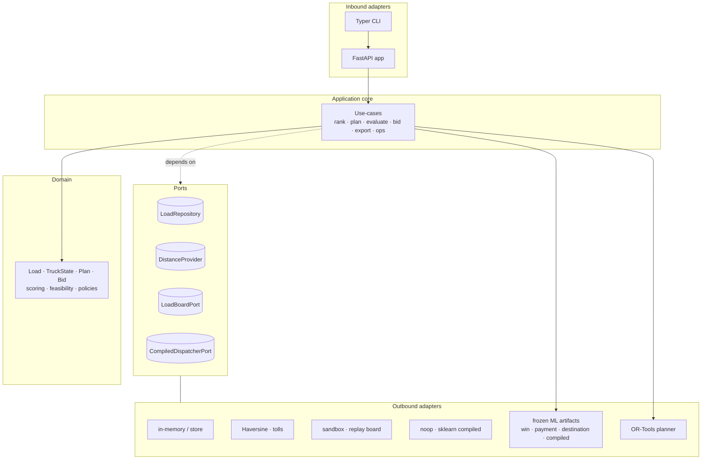

# FreightBid Agent — Architecture & Story

A short companion to the [README](README.md): *what* this system is, *how* it is built, and the *arc* it
travelled from a deterministic rules engine to an integration-ready, auditable decision tool.

---

## The one-paragraph story

FreightBid Agent answers a single operator question — *"which load should this hotshot truck bid on, at
what price, and why?"* — and it answers it the way a careful dispatcher would: score the feasible loads,
estimate the probability of winning the bid, weigh how likely the broker is to actually pay, fold that
into an expected **collectible** profit, check whether the win model can still be trusted, and then
recommend a bid, a no-bid, or a hand-off for human approval — always with an explanation. The project's
real point is engineering: it shows a decision system grown in disciplined layers — heuristics →
optimization → machine learning → risk modelling → a compiled "subterranean" agent → production
hardening — where every risky capability is flag-gated, every model is stress-tested while frozen, and
the auditable source engine always stays authoritative.

## Plan → delivery arc

The system was built as seven phases, each a measurable increment over the last. All seven are **shipped**
(556 tests passing; tags `v0.1.0` … `v0.7.5`, capstone `v0.7-complete`):

| Phase | What it added | The honest result |
| --- | --- | --- |
| **1 — Dispatch brain** | Deterministic cost model, weighted scoring, single-truck planner, CLI + API | A reviewer can rank loads and get an explained plan from one command. |
| **2 — Optimization** | OR-Tools (CP-SAT) routing + objective tuning along a Pareto frontier | Deadhead cut **−34%** at near-free profit by tuning the objective, not the data. |
| **3 — ML augmentation** | Destination-desirability model in the planner; rolling-replay A/B; 18-world stress test | **+3.9% profit / −4.7% deadhead** over 150 episodes, **0 regressions** across shifted markets. |
| **4 — Winnability & bidding** | Calibrated `P(win)`, expected-value bid ladder, human-in-the-loop approval | EV bidding beats the best fixed policy **+32.8%**; the edge **HOLDS 10/10** harder markets. |
| **5 — Risk-aware bidding** | Calibrated payment risk, risk-adjusted EV, calibration-drift monitor + recalibration | Headline metric becomes **realized collectible profit**; recalibration repairs **3/3** drifted worlds. |
| **6 — Compiled dispatcher** | Workflow graph + teacher traces → a distilled multi-head model run in shadow mode | Action **macro-F1 0.94**, but a safety-critical miss in **10/10** worlds → stays shadow-only. |
| **7 — Production readiness** | Real-data contracts, sandbox/replay connector, audit export, ops hardening, capstone demo | External-style data flows board → validate → recommend → approve → **export**, fully auditable. |

The narrative deliberately includes the *non*-wins: Phase 6 concludes the compiled model is **not** safe
enough to take control, and Phase 5 shows that payment quality only matters once you measure the right
profit. The boundaries are part of the engineering story.

## Layer map (Hexagonal / Ports & Adapters)

The domain core depends only on **ports** (interfaces). Frameworks, data sources, optimizers, and models
plug in behind those ports as **adapters**, so the core never imports FastAPI, scikit-learn, or OR-Tools.



**Directories** mirror the layers: `domain/` (entities, scoring, policies), `ports/` (interfaces),
`adapters/` (inbound CLI/API + outbound implementations), `application/` (use-cases, services,
ingestion), `ml/` (datasets, training, models, workflows), `benchmarks/` (stress tests + reproducible
charts), `config/` (YAML feature flags), `simulation/` (seeded synthetic market).

## The decision flow

One recommendation traverses an explicit pipeline — the same graph Phase 6 compiled into teacher traces:

```
intake goal -> read truck state -> pull / ingest load board -> validate (Phase 7.1 contracts)
  -> filter infeasible -> plan route (OR-Tools) -> score destination risk
  -> estimate P(win) [calibrated] -> estimate payment risk [P(default), E[pay_days]]
  -> compute risk-adjusted EV (expected collectible profit) -> check calibration / recalibration status
  -> choose bid / no-bid / approval-required -> explain -> (human approve/edit/reject) -> audit export
```

Every step is auditable: a `DecisionRecord` bundles the recommendation snapshot, warnings, the bid
draft's approval trail, and **model/config provenance** (`source_policy_version`, git SHA, config hash,
model-artifact ids), exportable to JSONL / CSV / an audit bundle — no database required.

## The source-of-truth-vs-compiled boundary

Phase 6 distils the orchestrated engine into a faster, lower-context **compiled dispatcher** — and then
refuses to trust it blindly. The compiled model runs in **shadow mode**: default **off**, and when on it
emits *additive* metadata beside the real recommendation, proven **byte-identical** when disabled. It
**cannot** draft, approve, or submit a bid, and it fails **closed** on a missing artifact, a feature-
manifest hash mismatch, invalid output, or any exception. The Phase 6.5 benchmark made the rule explicit:
the compiled model saves orchestration cost (~3.9 fewer engine calls/decision, a smaller payload, ~31s to
recompile after a rule change) but commits a safety-critical miss in every stress world, so **the source
engine stays authoritative**. The same `CompiledDispatcherPort` leaves room for a future fine-tuned LLM
adapter to be held to the identical safety bar.

## Design principles that held across all seven phases

- **Explainable by construction** — every bid carries its cost-and-rationale breakdown.
- **Flag-gated & byte-identical-when-off** — new risk never changes the trusted default path silently.
- **Frozen-model honesty** — stress tests never refit to flatter the result.
- **Realized collectible profit** — the objective accounts for *getting paid*, not just winning.
- **Determinism** — seeded worlds + committed artifacts + pinned tests make results reproducible.
- **No live side effects** — synthetic/sandbox board, `submit-mock` only; no live Truckstop, no
  auto-bidding.

## Tech stack

Python 3.13 · FastAPI · Typer · scikit-learn (HistGradientBoosting, calibration) · Google OR-Tools ·
pandas/numpy · pytest · Docker / docker-compose. **LLM-free** by design — the intelligence is classical
ML + optimization + explicit workflow logic.

---

*See the [README](README.md) for the full per-phase deep dive, the reproducible benchmarks, and the
[results table](README.md#results-at-a-glance).*
