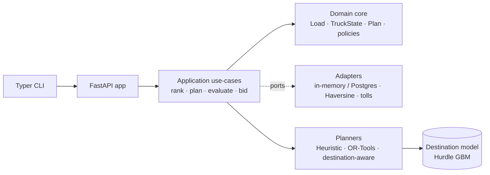
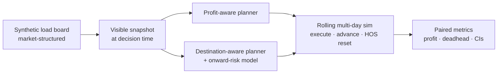
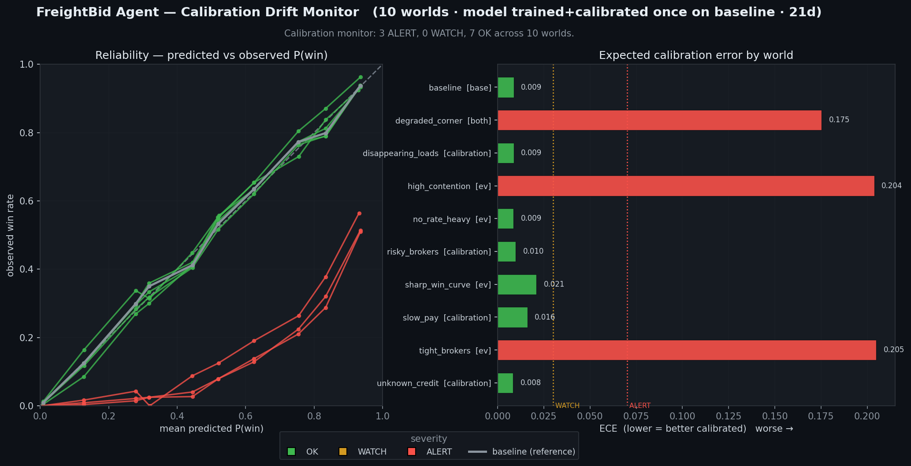

# FreightBid Agent

An AI-powered dispatch and bidding decision engine for hotshot trucking: it
recommends profitable loads, cuts deadhead, and plans routes through heuristic
scoring, OR-Tools optimization, a learned destination-risk model, and a rolling
multi-day dispatch simulation — every recommendation explainable.


## Project status

**Complete — Phases 1–7 shipped.** FreightBid Agent is a finished portfolio build: one hexagonal Python
decision engine carried from a deterministic dispatch brain all the way to an integration-ready,
auditable operator tool — every recommendation explainable, every risky capability flag-gated, the
source engine always authoritative. **556 tests pass**; the latest release tag is
[`v0.7.5-production-readiness-demo`](https://github.com/selleckelliott/freightbid_agent/tags), and
[`v0.7-complete`](https://github.com/selleckelliott/freightbid_agent/tags) marks the full-project capstone.

| Phase | Theme | Status |
| --- | --- | --- |
| 1 | Deterministic dispatch brain — cost model · scoring · CLI/API | ✅ Shipped |
| 2 | OR-Tools route optimization + Pareto objective tuning | ✅ Shipped |
| 3 | ML augmentation — destination model · rolling replay · stress tests | ✅ Shipped |
| 4 | Broker/load winnability — calibrated P(win) · EV bidding · approval workflow | ✅ Shipped |
| 5 | Risk-aware bidding — payment risk · risk-adjusted EV · calibration + recalibration | ✅ Shipped |
| 6 | Compiled dispatcher agent — workflow graph · distilled multi-head model · shadow mode | ✅ Shipped |
| 7 | Production readiness — data contracts · sandbox connector · audit export · ops hardening | ✅ Shipped |

**Start here:** [Results at a glance](#results-at-a-glance) · [Demo](#demo) ·
[Architecture & story](ARCHITECTURE.md) · [Reproduce](#reproduce) · [What I learned](#what-i-learned).

## Results at a glance

| Layer | Approach | Headline result |
| --- | --- | --- |
| [Heuristic baseline](#phase-2--or-tools-route-optimization) | rule-based scoring | $396.38 profit · 11.3 mi deadhead · 88.1% feasible |
| [OR-Tools profit-aware](#phase-2--or-tools-route-optimization) | CP-SAT, profit objective | $396.79 profit · 12.0 mi deadhead |
| [OR-Tools deadhead-control](#phase-23--objective-tuning-and-the-pareto-frontier) | tuned objective weights | $392.97 profit · **7.4 mi deadhead (−34.3%)** |
| [ML destination model](#phase-31--destination-desirability-model-first-ml-layer) | Hurdle GBM | MAE 49.3 vs 61.2 zone baseline · ≤50 mi 76% |
| [Destination-aware (one-shot)](#phase-32--destination-aware-planner-closing-the-loop) | model in the planner | −12.9% deadhead at ~free profit |
| [**Rolling replay (sequential)**](#phase-33--rolling-replanning-simulation-measuring-the-sequential-payoff) | multi-day MPC A/B | **+3.9% profit · −4.7% deadhead** (150 episodes) |
| [**Stress test (robustness)**](#phase-34--sequential-policy-stress-testing-is-the-edge-robust) | 18 shifted markets | **0 regressions** · advantage HOLDS 7/18, neutral 11/18 |
| [Winnability dataset (Phase 4.1)](#phase-41--load-quality--winnability-dataset) | seeded outcome simulator | labeled broker-quality + bid-win dataset · 6 processes · leakage-guarded |
| [**Bid-winnability model (Phase 4.2)**](#phase-42--calibrated-bid-winnability-model) | calibrated HGB classifier | **ROC AUC 0.928 · test ECE 0.010** · beats 3 baselines |
| [**EV bid recommender (Phase 4.3)**](#phase-43--expected-value-bid-recommender) | calibrated P(win) × margin → bid ladder | **+32.8% realized profit vs best fixed** · only $39 EV-regret vs a clairvoyant oracle |
| [**Broker-quality stress (Phase 4.5)**](#phase-45--broker-quality-stress-testing-does-the-bid-edge-survive-a-worse-market) | 10 broker-quality shifts · model frozen on baseline | **EV beats best fixed 10/10** · uplift grows to +160% as markets harden · payment risk shown **orthogonal** to bid profit |
| [**Payment-risk model (Phase 5.2)**](#phase-52--calibrated-payment-risk-model) | calibrated HGB `P(default)` + `E[pay_days]` head | **test ECE 0.003** · PR-AUC 0.140 > baselines · pay-days MAE 4.0d · the risk signal 5.1 folds into EV |
| [**Risk-adjusted EV (Phase 5.1)**](#phase-51--risk-adjusted-ev-objective) | fold 5.2 `p_collect` + `E[pay_days]` into the bid objective | objective → **expected collectible profit** · discounts revenue, keeps full cost · safer-broker preference · flag-gated, **byte-identical when off** |
| [**Calibration drift monitor (Phase 5.3)**](#phase-53--calibration-drift-monitor) | label-based `P(win)`-vs-outcome monitor over 10 frozen-model worlds | **3 ALERT / 7 OK** · reserve/win-curve worlds flagged (ECE ≈ 0.20, over-optimistic), payment shifts stay calibrated · severity OK/WATCH/ALERT |
| [**Recalibration workflow (Phase 5.4)**](#phase-54--recalibration-workflow) | post-hoc Platt map fit on a recent window, judged on a later holdout · base model frozen | **3/3 ALERT worlds repaired** (ECE ≈ 0.20 → ≈ 0.03, WATCH/OK) · promote-only-if-safer guardrail leaves the 7 calibrated worlds alone |
| [**Risk-aware stress test (Phase 5.5)**](#phase-55--risk-aware-stress-test-the-capstone) | full stack re-scored on **realized collectible profit** across the 10 worlds · models frozen | **Full risk-aware beats raw EV 4/10** (5 neutral, 1 honest regression) · recalibration carries the 3 win-curve worlds **+14–25%**, payment risk lifts `risky_brokers` **+5.7%** · baseline left flat |
| [**Workflow graph + teacher traces (Phase 6.1)**](#phase-61--workflow-graph--teacher-trace-generator) | compile the orchestrated engine into an explicit graph + deterministic teacher traces | **16-node graph · 19 edges** · 560 provenance-stamped traces · hard train/eval separation (**25** feature-eligible fields) · determinism-pinned |
| [**Dispatcher dataset (Phase 6.2)**](#phase-62--synthetic-dispatcher-conversation-dataset) | reshape the 560 traces into training examples in **two forms** (structured rows + NL conversations) | **asymmetric** train/eval boundary (inputs = 25-field `inference_context`; targets may predict engine outputs) · procedure-free prompt · deterministic human-in-the-loop (real approval enum) · determinism-pinned |
| [**Compiled dispatcher model (Phase 6.3)**](#phase-63--distilled-multi-head-compiled-dispatcher-model) | distill the workflow into a deterministic **multi-head sklearn model** that emits the JSON recommendation from case facts alone | **5 purpose-built heads** · action **macro-F1 0.94 vs 0.30** majority baseline · market-relative **bid-ratio** target ($35 MAE) · **manifest-hash-gated** (refuses to serve on mismatch) · full provenance · determinism-pinned |
| [**Shadow-mode dispatcher (Phase 6.4)**](#phase-64--shadow-mode-compiled-dispatcher-adapter) | run the compiled model **beside** the source engine for agreement/regret — never in control | **default OFF · source byte-identical** · 1 port / 2 adapters / 1 service · fails closed on disabled/no-artifact/**manifest-mismatch**/invalid-output/exception · can't draft/approve/submit · additive `/rank` banner · **29 tests** |
| [**Compiled-vs-source stress + cost (Phase 6.5)**](#phase-65--compiled-vs-orchestrated-stress--costcontext-benchmark) | benchmark the compiled model against the full source engine across 10 shifted worlds on **collectible-profit regret** + safety-critical misses + context/cost | **0/10 worlds PASS** the strict 2%-regret + zero-safety bar — compiled *tracks* source profit (within ±8% on 8/10, beats the naive baseline) but commits a **safety-critical miss in every world** and its tight-market warnings collapse (warn agreement **0.84 → 0.09**) · compiling replaces **~3.9 engine calls/decision**, shrinks the decision payload **1.7×**, recompiles after a rule change in **~31s** · verdict: **stays shadow-only, source stays authoritative** |
| [**Real-world data contracts (Phase 7.1)**](#phase-71--real-world-data-contracts) | anti-corruption ingress: messy external load/broker rows → a validated domain `Load`, PII redacted at one chokepoint | **integration-ready, not live** · CSV **and** JSON normalize to identical domain objects · per-row structured errors (**reject-row-not-batch**) · broker kept as a **redacted reference, never fed to ML** · internal `Load` + `/loads` ingress **byte-identical** · **21 tests** (488 total) |
| [**Sandbox connector / replay (Phase 7.2)**](#phase-72--sandbox-connector--replay-adapter) | a `LoadBoardPort` with a seeded **sandbox** generator + a recorded-feed **replay** adapter, and a thin live `pull` flow (board → 7.1 validate → ingest) | external data really flows through the running app: **`POST /loads/pull`** + `freightbid pull` · board is **dumb transport** (emits raw dicts; 7.1 validates) · replay **cursor paging**, fails closed on missing/unreadable feed · config-driven (`load_board.yaml`), **no live Truckstop** · synthetic `POST /loads` **byte-identical** · **17 tests** (505 total) |
| [**Durable decision & audit export (Phase 7.3)**](#phase-73--durable-decision--audit-export) | a `DecisionRecord` bundling the recommendation snapshot + warnings + the bid draft's **existing audit trail** + **model/config provenance**, and a `DecisionExporter` to JSONL / CSV / an audit **bundle** | decisions are auditable **outside the process** — **`GET /decisions`** (read-only) + `freightbid export` · records built **on-demand from live drafts** (**no DB / no Postgres**) · every record stamped with `source_policy_version` + `git` + `config_hash` + model-artifact ids · **CLI writes locally** (a request can never write a server path) · redacted broker **PII never leaks** into exports · **22 tests** (527 total) |
| [**Deployment & operations hardening (Phase 7.4)**](#phase-74--deployment--operations-hardening) | a readiness probe + **artifact-availability** report, a local **config-validate** preflight, an end-to-end **smoke-test**, and a hardened Docker image | run-it-confidently ops: **`GET /ready`** (liveness `/health` vs readiness, `ready`/`degraded`) + `freightbid ready` · `freightbid validate-config` (no server) · `freightbid smoke-test` drives health→ready→pull→ingest→rank→bid→decisions · Docker **HEALTHCHECK** + **non-root** user · readiness is **side-effect-free**, existing endpoints **byte-identical** · **17 tests** (544 total) |
| [**Production-readiness capstone (Phase 7.5)**](#phase-75--production-readiness-capstone-demo) | one end-to-end demo wiring **every** Phase 7 capability: board pull → 7.1 validate → broker redaction → ingest → **source recommend** → human approval → 7.3 audit export → ops checks | the closing proof: `benchmarks/run_production_readiness_demo.py` runs **9/9 stages PASS** in-process (no server) · a **deterministic** committed `production_readiness_summary.json` + transcript · source engine stays **authoritative** · `submit-mock` simulated, **no auto-bidding** · raw broker **PII never crosses** the redaction boundary · **12 tests** (556 total) |

Single-truck, synthetic-market simulation: the claim is **sign-stable, explainable**
dispatch gains across markets, not a magic number — see
[What I learned](#what-i-learned) and [Limitations & next work](#limitations--next-work).

## Demo

The CLI ranks loads and proposes a single-truck plan, each with a full
cost-and-bid rationale — rendered straight from the API against `sample_data/`
(regenerate with `python -m benchmarks.render_demo --update-artifacts`).

`freightbid rank sample_data/truck.json` — top loads with target bid + explanation:


`freightbid plan sample_data/truck.json` — the proposed plan with per-stop economics:


## Architecture (Hexagonal / Ports & Adapters)

> For the full architecture **and the project story** — the plan → delivery arc, the layer map, the
> end-to-end decision flow, and the source-of-truth-vs-compiled boundary — see
> **[ARCHITECTURE.md](ARCHITECTURE.md)**.

**System** — a thin CLI/API over an application core that depends only on ports;
adapters and planners plug in behind them.



**Decision flow** — how a load board becomes a measured dispatch decision.



Detailed module layout:

```
domain/          Pure business types (Load, TruckState, Plan, Bid, ScoreResult,
                 LoadEvaluation), policies (constraints, feasibility, weights),
                 and the ScoringStrategy interface (Strategy Pattern).
ports/           Outbound interfaces: LoadRepositoryPort, TruckRepositoryPort,
                 DistanceProviderPort, TollEstimatorPort, ClockPort.
adapters/
  inbound/api/   FastAPI app + Pydantic schemas + composition root.
  inbound/cli/   Typer CLI that calls the API (rich tables).
  outbound/memory/    In-memory repositories  (TEST adapter for the port).
  outbound/postgres/  SQLAlchemy + Postgres repositories (REAL adapter).
  outbound/distance/  Haversine distance provider.
  outbound/tolls/     Flat-rate per-state toll estimator.
application/     Use cases: EvaluateLoadsService, RecommendLoadsService,
                 PlanBuilderService, BidRecommenderService, ConfigLoader,
                 ORToolsDistancePlanner, ORToolsProfitAwarePlanner.
config/          Editable YAML for cost model, weights, constraints.
```

> "One port, two adapters": every outbound port has at least an **in-memory test
> adapter** and a **real adapter** (Postgres, Haversine, FlatRate). The
> `ScoringStrategy` is the swappable Strategy interface (heuristic today;
> ML/LP-based variants later).

## Reproduce

One command regenerates the demo and a reduced rolling A/B **non-destructively**
— it writes only to the gitignored `benchmarks/reproduced/` (so `git status`
stays clean) and prints a run-metadata header plus the results table above:

```bash
python -m benchmarks.reproduce                     # fast smoke (~1-3 min), clean checkout OK
python -m benchmarks.reproduce --update-artifacts  # refresh the committed demo SVGs
python -m benchmarks.reproduce --full              # canonical long benchmark (~70 min)
```

On a fresh clone the gitignored model artifact is absent, so the fast path
quick-trains a small seeded destination model into `benchmarks/reproduced/`
(seconds) just to drive the reduced chart. `--full` regenerates the committed
canonical artifacts (150-episode replay + 18×30 stress sweep).

## Cost Model
Fuel, tolls, time (driver + opportunity cost), and deadhead are tracked
**separately** on `LoadEvaluation` and rolled up into `Plan` totals.

## API
- `POST /loads` — ingest a batch of loads
- `GET  /loads` — list ingested loads
- `DELETE /loads` — clear ingested loads
- `POST /rank` — top-N ranked loads for a truck (with recommended bid range + rationale)
- `POST /plan` — propose a single-truck plan over the planning horizon (default 48h)
- `GET  /health` — health probe

## Quick start (Docker Compose)

```bash
docker compose up --build
# in another shell:
curl -s http://localhost:8000/health
curl -s -X POST http://localhost:8000/loads -H 'content-type: application/json' \
  -d @sample_data/loads.json
curl -s -X POST http://localhost:8000/rank -H 'content-type: application/json' \
  -d @sample_data/rank_request.json | jq
curl -s -X POST http://localhost:8000/plan -H 'content-type: application/json' \
  -d @sample_data/rank_request.json | jq
```

## Quick start (local)

```bash
pip install -r requirements.txt
uvicorn adapters.inbound.api.app:app --reload
# in another shell:
python -m adapters.inbound.cli.main ingest sample_data/loads.json
python -m adapters.inbound.cli.main rank sample_data/truck.json --top-n 10
python -m adapters.inbound.cli.main plan sample_data/truck.json
```

## API response shapes (reference)

The same `sample_data` run as the [demo above](#demo), shown as raw JSON to
document the `/rank` and `/plan` response contracts (truck `101`, 4 loads):

**`GET /health`**
```json
{"status": "ok"}
```

**`POST /loads`** (body: `sample_data/loads.json`)
```json
{"accepted": 4}
```

**`POST /rank`** (body: `sample_data/rank_request.json`) — top ranked loads:
```json
{
  "truck_id": 101,
  "ranked": [
    {
      "load_id": 1,
      "score": 612.48,
      "expected_profit": 466.90,
      "expected_revenue": 850.00,
      "rate_per_mile": 3.54,
      "deadhead_miles": 0.0,
      "driver_hours": 6.3,
      "pickup_eta": "2026-05-27T18:00:00Z",
      "delivery_eta": "2026-05-28T00:18:00Z",
      "rationale": "profit=$466.90 x 1.0 + rpm=$3.54 x 50.0 - deadhead=0mi x 0.5 - hours=6.3h x 5.0 => score=612.48",
      "bid": {
        "min_bid": 402.26,
        "target_bid": 459.72,
        "max_bid": 517.19,
        "breakeven": 383.10,
        "rationale": "Cost=$383.10, target margin=20%, target=$459.72 ($1.92/mi). Range [$402.26, $517.19] clamped to [$100, $25000] and [$1.00, $6.00]/mi."
      }
    },
    {
      "load_id": 3,
      "score": 513.13,
      "expected_profit": 370.20,
      "expected_revenue": 720.00,
      "rate_per_mile": 3.43,
      "deadhead_miles": 0.0,
      "driver_hours": 5.7,
      "pickup_eta": "2026-05-27T20:00:00Z",
      "delivery_eta": "2026-05-28T01:42:00Z",
      "bid": {
        "min_bid": 367.29,
        "target_bid": 419.76,
        "max_bid": 472.23,
        "breakeven": 349.80
      }
    }
  ]
}
```

**`POST /plan`** (body: `sample_data/rank_request.json`) — proposed 48h plan:
```json
{
  "plan_id": 1,
  "truck_id": 101,
  "horizon_hours": 48.0,
  "stops": [
    {
      "load_id": 1,
      "pickup_eta": "2026-05-27T18:00:00Z",
      "delivery_eta": "2026-05-28T00:18:00Z",
      "deadhead_miles": 0.0,
      "load_miles": 240.0,
      "revenue": 850.00,
      "cost": 383.10,
      "profit": 466.90
    }
  ],
  "expected_revenue": 850.00,
  "expected_cost": 383.10,
  "expected_profit": 466.90,
  "expected_deadhead_miles": 0.0,
  "expected_load_miles": 240.0,
  "expected_deadhead_cost": 175.20,
  "expected_load_cost": 0.0,
  "expected_toll_cost": 0.0,
  "expected_time_cost": 207.90,
  "feasible": true,
  "score": 612.48,
  "rationale": "Sequenced 1 load(s) [1] over 48h horizon. Revenue=$850.00, Cost=$383.10, Profit=$466.90, Deadhead=0mi."
}
```

## Phase 2 — OR-Tools Route Optimization

Phase 2 reframes planning as a **prize-collecting pickup-and-delivery problem**
solved with Google OR-Tools CP routing, benchmarked against the Phase 1
heuristic over 1,000 generated scenarios. Two solver variants isolate the
effect of the objective function:

| Planner | Objective | Avg profit | Avg deadhead | Feasible rate |
|---|---|---|---|---|
| Heuristic (`PlanBuilderService`) | greedy score ranking | $396.38 | 11.3 mi | 88.1% |
| `ORToolsDistancePlanner` (v1) | minimize total miles | $240.14 (**−39.4%**) | **8.9 mi (−20.9%)** | 82.4% |
| `ORToolsProfitAwarePlanner` (v2) | maximize expected profit | **$396.79 (+0.1%)** | 12.0 mi (+6.6%) | **88.1%** |


**The ablation story.** The distance objective is a classic mis-specified
proxy: it slashes deadhead by 21% but destroys 39% of profit, because the
cheapest route to drive is rarely the most valuable one to run. The
profit-aware variant fixes the objective rather than the solver — same
constraints, same search budget — and recovers full heuristic-level profit
while retaining the solver's ability to chain multi-load routes.

**Objective formulation (profit-aware).** The solver minimizes the negative of
expected plan profit, in integer cents, derived from the YAML cost model — no
hand-tuned magic weights:

- *Repositioning arcs* cost `miles × 139¢` (fuel + maintenance + driver &
  opportunity time at average speed, from `config/cost_model.yaml`).
- *Loaded arcs* cost 0 — their economics live in the skip penalty.
- *Skipping a load* costs its position-independent static profit
  (revenue − operating cost − time cost), floored at the configured
  `min_expected_profit`: profitable loads are expensive to skip, marginal
  ones are free to drop.

Minimizing (deadhead cost + skipped profit) is equivalent to maximizing
(selected profit − deadhead cost) = expected plan profit.

Every solver plan is **replayed through the same `EvaluateLoadsService` +
feasibility pipeline as the heuristic**, so reported financials come from one
source of truth, and the solver cannot game its own reward. Both planners
share the constraint encoding (pickup-and-delivery pairing, time windows,
HOS-style driver-hours dimension, planning horizon) in
`application/ortools_distance_planner.py`; the profit-aware subclass overrides
only the objective hooks, first-solution strategy, and full-truckload
sequencing. Reproduce with:

```bash
python -m benchmarks.compare_planners --time-limit 0.2 --out benchmarks/compare_results.json
python -m benchmarks.chart_comparison --results benchmarks/compare_results.json
```

## Phase 2.3 — Objective Tuning and the Pareto Frontier

"Maximize profit" is only one dispatch policy. An operator who hates empty
miles (wear, risk, schedule fragility) may happily trade a percent of profit
for far less deadhead. Phase 2.3 turns the profit-aware objective into a
**configurable policy** and maps the tradeoff empirically: a tuning harness
(`benchmarks/tune_objective.py`) sweeps 24 objective configurations over the
same 1,000 scenarios and computes the profit-vs-deadhead **Pareto frontier**
(feasible rate ≥ 85% required; non-dominated configs only).


Only two knobs exist, both multipliers over the derived cost model — and that
is a finding, not a simplification:

- **`deadhead_cost_multiplier`** — how much above true cost to price an empty
  mile (1.0 = the real cost model).
- **`skip_profit_floor_dollars`** — solver pickiness: the static profit a load
  must clear before skipping it costs anything. Swept only **at or above**
  the business `min_expected_profit` ($50) — an objective floor below the
  replay's acceptance rule would reward the solver for proposing loads the
  feasibility pipeline then rejects.

The objective is `Σ(deadhead miles × D) + Σ(skipped margin × P)`, so scaling
`D` and `P` jointly cannot change which plan wins — only the **D/P ratio**
matters. The harness proves it (`--invariance-check`): tripling both rates
reproduces every plan bit-for-bit; tripling only `D` changes them
(−67% deadhead, −3% profit on the check slice). A naive "skip penalty
multiplier" sweep axis would have silently doubled the grid for zero
information.

**Named dispatch profiles** (`config/objective_profiles.yaml`), placed on the
measured frontier (1,000 scenarios):

| Profile | D × floor | Avg profit | Avg deadhead | Feasible |
|---|---|---|---|---|
| `max_profit` | 1.0 × $50 | **$396.79 (+0.1%)** | 12.0 mi (+6.6%) | 88.1% |
| `balanced` | 1.25 × $50 | $395.90 (−0.1%) | 10.0 mi (−11.7%) | 86.9% |
| **`deadhead_control`** ⭐ | 1.6 × $75 | $392.97 (−0.9%) | **7.4 mi (−34.3%)** | 85.4% |
| `aggressive_deadhead_control` | 2.5 × $100 | $384.91 (−2.9%) | 3.9 mi (−65.4%) | 81.9% ✗ |

*(deltas vs the heuristic baseline; ✗ = fails the ≥ 85% feasibility filter)*

**Findings.**

- **The Phase 2.2 derivation sits exactly at the frontier's max-profit end.**
  Under-pricing deadhead (0.75×) is *dominated* — more deadhead **and** less
  profit — empirical validation that the cost-model-derived 139 ¢/mi was the
  right calibration, not a lucky guess.
- **The recommended knee: `deadhead_control` cuts deadhead 34% for 0.9%
  profit** (largest deadhead reduction costing < 2% of best-config profit).
- **Deadhead aversion has a feasibility cliff.** Past ~1.6× the planner
  increasingly refuses to plan at all (feasible rate slides from 88% toward
  80%) — the floor knob mostly trades feasibility, the multiplier knob trades
  deadhead, and the filter keeps the frontier honest.
- **Runtime is not a tradeoff axis here.** The knee config produces
  bit-identical plans at 0.1 s and 1.0 s per solve (`--time-study`): the
  solver converges in under 100 ms at this instance size (≤ ~20 loads), so
  "fast vs good" is a non-decision until instances grow.

Reproduce with:

```bash
python -m benchmarks.tune_objective --time-limit 0.2 --out benchmarks/tuning_results.json
python -m benchmarks.tune_objective --invariance-check --limit 200
python -m benchmarks.tune_objective --time-study --out benchmarks/tuning_results.json
python -m benchmarks.chart_pareto --results benchmarks/tuning_results.json
```

## Phase 3.1 — Destination Desirability Model (first ML layer)

Phases 2.x optimize *today's* board. But a load that pays well today can still be
a trap if it **delivers into a dead market** — somewhere the next load is far
away or doesn't exist, forcing a long deadhead. Phase 3.1 learns that risk.

The model predicts **`expected_next_deadhead_miles`**: given a candidate
delivery (destination, arrival time, equipment), how far will the truck likely
have to deadhead to its *next* viable load? This becomes a learned
"future-opportunity" signal the planner can price in Phase 3.2
(`future_deadhead_penalty = predict_next_deadhead(...) × deadhead_cost_per_mile`).
**No planner code changes in 3.1** — the `DestinationDesirabilityService` facade
defines the contract; wiring comes later.

**Label (retrospective truth).** After a delivery, search a window
(`8h`) for the nearest viable next load — same equipment, picks up after
arrival, clears a rate bar (`≥ 1.75 $/mi`; "call for rate" loads don't count).
The label is the haversine miles to that load's origin, **censored at 300 mi**
when nothing qualifies (a genuine stranding signal, ~8% of rows).

**Leakage discipline (the hard part).** Two failure modes are designed out:
- *Decision-time features only.* Market-density features (how many loads, and
  how many equipment-matched loads, are posted within 50/100/150 mi of the
  destination *right now*) are read from the same board on which the load
  appears — never from the future board the label looks at. One feature builder
  serves both training and inference, so there's no train/serve skew.
- *Embargo + observability split.* The split is time-based (last 20% is test).
  Labels are computed against the full history (no per-pool truncation), then
  train rows whose label window reaches into the test period are **embargoed**,
  and rows whose window runs off the end of the data are dropped as
  **unobservable**. (An earlier per-pool labeling scheme manufactured fake
  "stranded" labels at each pool's edge and silently wrecked the model — there's
  a regression test for it now.)

**Model — a hurdle (two-part) regressor.** The label is right-censored and
heavy-tailed (a spike at 300 mi over a bulk of short deadheads), so a single
regressor either ignores the spike (good MAE, ~0 R²) or is dragged toward the
mean (good R², poor MAE). Instead:
- a `HistGradientBoostingClassifier` estimates `p = P(no viable next load)`;
- a `HistGradientBoostingRegressor` (absolute-error → conditional median of the
  *non-censored* bulk) estimates the deadhead when a load exists;
- they recombine into a proper expectation: `E[miles] = p·300 + (1−p)·bulk`.

Both halves use native categorical handling (`destination_zone`,
`destination_state`, `equipment_type`, `mode`) — no one-hot.

**Results** (held-out last-20%-by-time test set, 3,594 rows, 8.3% censored):

| Model | MAE | RMSE | MedAE | R² | ≤25 mi | ≤50 mi | top-3 |
|---|---|---|---|---|---|---|---|
| Global mean | 69.8 | 96.8 | 44.5 | −0.00 | 5% | 73% | 37% |
| Zone × daypart | 61.2 | 89.2 | 32.1 | 0.15 | 39% | 66% | 45% |
| **Hurdle GBM** | **49.3** | **88.7** | **13.2** | **0.16** | **64%** | **76%** | **50%** |

The model beats both baselines on **every** metric. Because the target is
censored, MAE / median / bucket-accuracy / **top-3 ranking** (its real job —
ranking destinations) are the headline metrics; R² is reported but secondary.
MedAE of 13 mi vs the baseline's 32 mi, and a 64% ≤25 mi hit rate, mean the
model usually nails the easy "you'll find a reload nearby" calls and reserves
big predictions for genuinely weak destinations.

**Why synthetic data?** Real historical board data isn't available yet, so a
seeded generator manufactures *learnable* structure: strong hubs (Dallas,
Houston, LA…) flood the board while weak markets (Boise, Albuquerque) barely
appear, and each metro has its own **hot-shot equipment mix** — so an `F`
(flatbed) load delivering into a Hot-Shot-heavy market correctly faces a high
expected deadhead (an interaction a zone-only baseline can't see, but the model
can). The schema mirrors the **real Truckstop board** (see Phase 3.0.5 below),
so a future API adapter drops in unchanged.

Reproduce (artifacts are seeded; the `.joblib` and JSONL history are
gitignored, the metadata JSON is committed):

```bash
python -m ml.training.train_destination_model --config config/ml_config.yaml
python -m ml.training.evaluate_destination_model --config config/ml_config.yaml
```

> **Phase 3.0.5 / 3.1.1 — Truckstop feature discovery (grounded).** Real board
> screenshots were captured and folded into the schema:
> `docs/truckstop_feature_discovery.md` holds the observed-field inventory. The
> board's columns confirmed the existing design (load age, "call-for-rate"
> nullable rate, derived rate-per-mile) and added real fields — hot-shot
> equipment codes (`HS`/`F`/`FSD`/`FSDV`), `weight`/`length` (+ usually-blank
> `width`/`height`), `mode` (TL/PTL/LTL), and a `Load Views` competition bucket
> (now the `open_match_within_*` "uncontested onward supply" feature). Crucially,
> the board shows deadhead only to a *user-specified* point (`O-DH` to pickup,
> `D-DH` to a typed destination) — never the open-ended next-load deadhead this
> model predicts, so the ML layer is **additive**. Broker-quality signals
> (`Days-to-Pay`, credit/bond) are observable but describe *load winnability*,
> not onward deadhead, so they're deferred to a future Phase 4 quality model.

## Phase 3.2 — Destination-Aware Planner (closing the loop)

Phase 3.1 *predicted* onward deadhead but changed no decisions. Phase 3.2 wires
that prediction into the optimizer so it actually **influences dispatch**.

The profit-aware planner prices the deadhead needed to *reach* each load, but is
blind to the deadhead a load's **destination** will impose on the *next* load.
`ORToolsDestinationAwarePlanner` subclasses it and changes a **single objective
hook** (`_drop_penalty`): each load's skip penalty becomes its static profit
*net of its destination's expected onward-deadhead cost*, above the floor:

```
skip_penalty = max(0, static_profit − dest_cost − floor) × profit_multiplier
dest_cost    = predict_next_deadhead(...) × deadhead_$_per_mile × weight
```

Folding `dest_cost` in *before* the floor keeps the solver's serve-vs-skip
break-even exact. A load delivering into a strong market keeps its full value; a
load into a weak market loses skip-incentive, so the solver declines
otherwise-profitable freight that would strand the truck. The penalty is
**position-independent** (it depends only on the destination, arrival window and
the visible board), so it stays a per-load disjunction penalty — no
path-dependent arc cost. With `destination_service=None` the planner is
byte-for-byte the profit-aware planner: **the ML signal is a feature flag, not a
fork** (and `destination_weight` scales it).

**The domain ↔ ML boundary (kept honest).** The planner speaks the domain's
trailer vocabulary (`Dry Van`/`Reefer`/`Flatbed`); the model trained on hot-shot
board codes. Two small, deliberately coarse adapters bridge them: an equipment
map (`Flatbed→F`, `Dry Van→FSDV`, everything else→`HS`) and a `_BoardLoad`
wrapper that re-shapes a domain `Load` into the feature builder's board contract
— the same contract a real Truckstop feed would satisfy. The decision-time board
is the prefiltered candidate set (each candidate excluded from its own board).

**A/B result** (1000-scenario suite, OR-Tools 0.2 s/solve, `weight=1.0`):

| Planner | Avg profit | Avg deadhead | Avg loads | Feasible | Median solve |
| --- | --- | --- | --- | --- | --- |
| Heuristic (scoring) | $396.38 | 11.3 mi | 0.91 | 88.1% | 0.2 ms |
| OR-Tools Distance | $240.14 | 8.9 mi | 0.88 | 82.4% | 202 ms |
| OR-Tools Profit-Aware | **$396.79** | 12.0 mi | 0.91 | 88.1% | 202 ms |
| OR-Tools Destination-Aware | $393.23 | **10.5 mi** | 0.89 | 86.1% | 275 ms |

Destination-aware vs. its profit-aware parent: **−0.9% profit, −12.9% deadhead,
−2.4% loads.** (The ~80 ms extra solve time is the per-candidate ML inference.)

**Reading this honestly.** This is a *one-shot* benchmark: each scenario plans
once from a fixed truck position, so the planner can only ever *decline* a load —
it never gets to collect the better next load its choice sets up. Even so, the
trade is favorable: it gives up just **0.9% of immediate profit to cut deadhead
12.9%**, declining loads bound for weak markets that the profit-aware planner
takes blindly. That's the safety behavior we wanted, and it's nearly free here.
The *full* payoff (actually collecting the closer next load) only materializes
under **sequential replanning** — a rolling multi-day simulation is the natural
next step (Phase 3.3) to measure it end-to-end. Charging the full predicted cost
(`weight=1.0`) in a one-shot plan is intentionally the most conservative setting;
`destination_weight` tunes the profit-vs-repositioning trade.

Reproduce (destination-aware column appears only when the gitignored model
artifact exists locally):

```bash
python -m benchmarks.compare_planners --time-limit 0.2 --out benchmarks/compare_results.json
```

## Phase 3.3 — Rolling Replanning Simulation (measuring the sequential payoff)

The Phase 3.2 A/B was *one-shot*: the planner chooses once, so it can only ever
**decline** a stranding load — it never gets to collect the better next load its
choice sets up. That's why it cost 0.9% profit to save deadhead. Phase 3.3 builds
the missing piece: a **rolling-horizon (MPC-style) simulation** that lets a truck
replan over a multi-day week, so the destination signal's *downstream* payoff
shows up end-to-end.

**How it works.** Each **episode** is one synthetic world — a time-stamped stream
of board snapshots from the **Phase 3.1 generator** (the same market structure the
model trained on, so it is tested in-distribution, *not* on the uniform benchmark
generator). The loop is deliberately thin (`simulation/`):

```
observe visible board → planner picks → execute only the first load → advance
truck (position, clock, HOS) → replan at the next snapshot → … until the horizon
```

* **`SnapshotBoard`** answers "what can the truck take right now?": the latest
  snapshot at or before the clock, filtered by equipment, pickup-window expiry,
  radius and consumed loads, then adapted from ML records to domain `Load`s.
* **`TruckSimulator`** owns *no cost math*. The planners already produce a
  position-aware financial replay on `plan.stops[0]` via `EvaluateLoadsService`,
  so the simulator just **lifts those realized numbers** and advances the truck to
  the delivered destination — rolling metrics therefore reconcile exactly with the
  one-shot engine (there is a regression test for this). A simple daily
  Hours-of-Service reset keeps a single truck from running dry after day one.
* **Same world, same truck, every planner.** Only the dispatch policy differs.

**Policy divergence (shadow comparison).** To explain effect size, while the
profit-aware truck runs, the destination-aware planner rides along as a *shadow*:
at each decision it is asked what it *would* pick from the **identical** board and
truck state, **without executing**. The agreement flag yields a
`decision_overlap_rate`. Forced idles (both planners decline an HOS-depleted
board) are excluded — only genuine choice points count.

**A/B result** (150 episodes × 7-day horizon, OR-Tools 0.2 s/decision,
`weight=1.0`; 95% bootstrap CIs):

| Planner | Cumulative profit | Cumulative deadhead | Idle hrs | Loads | Profit/day | Deadhead/load |
| --- | --- | --- | --- | --- | --- | --- |
| OR-Tools Profit-Aware | $1,682.7 `[1562, 1806]` | 123.7 mi `[110, 138]` | 67.8 | 5.6 | $240.4 | 19.6 mi |
| OR-Tools Destination-Aware | **$1,749.0** `[1624, 1878]` | **118.0 mi** `[106, 130]` | 67.7 | 5.6 | **$249.9** | **18.9 mi** |

Destination-aware vs. its profit-aware parent: **+3.9% profit and −4.7% deadhead**
(−3.8% deadhead per load), idle hours and load count flat.

**The headline: rolling flips the one-shot trade-off.** What cost 0.9% profit in
the single-shot benchmark now *earns* +3.9% — because the truck actually collects
the closer next load that pricing onward-deadhead set up. Same model, same weight;
the only change is letting decisions compound. That is exactly the hypothesis this
simulation was built to test.

**Reading this honestly.** The two policies agree **92.4%** of the time (divergence
**7.6%** over 838 genuine decisions), so the effect is carried by a minority of
episodes, and a paired per-episode view (both planners ran the same world) is the
fair lens:

* **Profit:** mean Δ **+$66.3/episode** — better in **34** episodes, tied in **98**,
  worse in **18**.
* **Deadhead:** mean Δ **−5.8 mi/episode** — better in **30**, tied in **98**,
  worse in **22**.

So on the ~1/3 of worlds where the policies diverge, destination-awareness wins
clearly more often than it loses, and never hurts on the other two-thirds. Two
honest caveats: (1) a single-truck, simple-HOS model completes only ~5.6 loads/
week, which bounds how much decisions can compound; (2) the model's *predicted*
onward-deadhead barely tracks the *realized* onward miles in this loop
(correlation ≈ 0.02, MAE ≈ 17.8 mi) — the realized proxy is shaped by HOS timing
and the next snapshot, not destination strength alone — yet the **aggregate
dispatch nudge is still net-positive**. Tightening that signal (and multi-truck /
finer HOS) is the natural Phase 4+ direction. See
`benchmarks/rolling_replay_comparison.png` for the full distribution view.

Reproduce (destination-aware trajectory appears only when the gitignored model
artifact exists locally):

```bash
python -m benchmarks.run_rolling_replay --episodes 150 --out benchmarks/rolling_replay_summary.json
python -m benchmarks.chart_rolling_replay
```

## Phase 3.4 — Sequential Policy Stress Testing (is the edge robust?)

Phase 3.3 showed the destination-aware policy wins **in one synthetic world**. The
question a skeptical reviewer asks next — and the one that separates a portfolio
*toy* from a portfolio *result* — is whether that win is real or an artifact of the
baseline market. Phase 3.4 answers it by replaying the same rolling A/B under **18
shifted market conditions** and asking: does the advantage survive?

**Design.** One *condition* is a perturbation of the baseline world / economics /
HOS. The sweep is **one-factor-at-a-time** (OFAT) — move a single axis, hold the
rest at baseline — plus three **combined stress corners**:

* **market density** — 25 / 120 loads per snapshot (baseline 60)
* **unposted-rate fraction** — 0.35 / 0.50 (baseline 0.15)
* **load-view competition** — 25% / 50% of visible loads skimmed first by rival
  demand, biased toward high-view (contested) loads (`simulation/snapshot_board.py`)
* **fuel / deadhead cost** — $0.95/mi fuel, or 1.5× empty-mile burn — rebuilds the
  *whole* cost stack: the realized evaluator **and** the planners' objective
  weights, so they optimise the same economics they're scored on
* **HOS strictness** — 8 h / 14 h daily drive cap (baseline 11 h)
* **equipment mix** — pin every truck to hot-shot, or to flatbed
* **horizon length** — 3 / 14 days (baseline 7)
* **corners** — thin market (scarce + half-unpriced + half-contested), expensive
  miles under a tight HOS cap, and a worst case combining all of it over 14 days

Two choices keep it honest. (1) **The model artifact never changes** — it is the
same one trained on the baseline distribution, so every condition is an
**inference-time distribution shift, not a retrain** (testing whether a fixed
learned signal generalises). (2) Every condition shares the baseline's seed stream
(**Common Random Numbers**), so a condition's only difference from baseline is the
perturbed parameter — a variance-reduced comparison. Each condition earns a paired
verdict: **HOLDS** (paired profit CI ≥ 0 *and* deadhead no worse), **REGRESSION**
(paired profit CI entirely < 0), otherwise **NEUTRAL**.

**Result** (18 conditions × 30 episodes × 2 planners, OR-Tools 0.2 s/decision,
68.7 min; Δ = destination-aware − profit-aware, 95% paired bootstrap CIs):

| Condition | Shift from baseline | Verdict | Profit Δ% `[95% CI]` | Deadhead Δ% |
| --- | --- | --- | --- | --- |
| `baseline` | the Phase 3.3 world | **HOLDS** | **+3.9** `[+0.3, +7.8]` | −16.4 |
| `density_low` | 25 loads/snapshot | neutral | +0.5 `[−1.5, +2.9]` | +2.3 |
| `density_high` | 120 loads/snapshot | neutral | +1.3 `[−0.8, +4.1]` | −4.8 |
| `unposted_035` | 35% "call for rate" | **HOLDS** | **+8.1** `[+3.5, +13.3]` | −5.5 |
| `unposted_050` | 50% "call for rate" | **HOLDS** | **+5.4** `[+1.5, +10.5]` | −2.6 |
| `competition_025` | 25% of board skimmed | neutral | +5.1 `[−0.0, +11.3]` | −11.2 |
| `competition_050` | 50% of board skimmed | neutral | +2.3 `[−0.3, +5.4]` | −6.8 |
| `fuel_095` | fuel $0.55→$0.95/mi | **HOLDS** | **+9.6** `[+2.7, +16.9]` | −1.8 |
| `deadhead_15` | 1.5× empty-mile burn | neutral | +3.8 `[−0.2, +9.8]` | −10.8 |
| `hos_strict_8` | 8 h daily drive cap | neutral | +2.9 `[−1.6, +7.9]` | −4.4 |
| `hos_relaxed_14` | 14 h daily drive cap | neutral | +1.7 `[−2.8, +6.7]` | −9.2 |
| `equip_hs` | all trucks hot-shot | **HOLDS** | **+3.7** `[+1.2, +6.8]` | −14.0 |
| `equip_f` | all trucks flatbed | neutral | +3.4 `[−0.4, +8.4]` | −9.0 |
| `horizon_3` | 3-day horizon | **HOLDS** | **+6.9** `[+0.9, +14.0]` | −33.1 |
| `horizon_14` | 14-day horizon | **HOLDS** | **+6.7** `[+2.4, +11.7]` | −6.7 |
| `corner_thin_market` | scarce + unpriced + contested | neutral | +3.0 `[−1.8, +9.5]` | −4.3 |
| `corner_expensive_miles` | costly miles + tight HOS | neutral | +4.2 `[−5.1, +12.4]` | −15.1 |
| `corner_worst_case` | everything hostile, 14-day | neutral | −2.8 `[−14.2, +6.6]` | −17.8 |

**The headline: zero regressions across all 18 conditions.** Profit improves in
**17/18** (the lone dip is the deliberately brutal worst-case corner at −2.8%, whose
CI `[−14.2, +6.6]` straddles zero — not a significant loss), and deadhead falls in
**17/18**. The advantage is **significant (HOLDS) in 7** conditions and
**directionally positive but not individually significant (neutral) in 11**.

**Reading this honestly.** At 30 episodes/condition the per-condition CIs are wide,
so most shifts land "neutral": the point estimate favours destination-awareness but
the interval still includes zero. What's compelling is not any single cell — it's
the **consistency of sign**. The edge never reverses, and it is strongest exactly
where the economics say it should be: expensive empty miles (`fuel_095` **+9.6%**),
a sparse *priced* board (`unposted_035` **+8.1%**), and longer horizons that let
decisions compound (`horizon_14` **+6.7%**). Even the worst-case corner — scarce,
contested, expensive, HOS-throttled, over two weeks — still **cuts deadhead 17.8%**
while giving back only a statistically-insignificant slice of profit. The one place
deadhead ticks *up* (`density_low`, +2.3%) is also not significant.

The caveat from Phase 3.3 carries over and bounds the magnitudes: a single truck
with a simple daily-HOS model completes only ~5–6 loads/week, so there is limited
room for a per-load signal to compound. The robustness claim here is deliberately
modest and precise — **sign stability of the destination-aware advantage across a
wide spread of markets**, not a large effect in any one of them. That a fixed
signal trained on one distribution stays net-positive under density, competition,
cost, HOS, equipment, and horizon shifts is the evidence that the Phase 3.1→3.3
loop learned something real rather than overfitting the baseline world. See
`benchmarks/stress_test_comparison.png` for the forest plot.

Reproduce (destination-aware trajectory appears only when the gitignored model
artifact exists locally; otherwise every condition is reported `DEST_SKIPPED`):

```bash
python -m benchmarks.run_stress_test --episodes 30 --out benchmarks/stress_test_summary.json
python -m benchmarks.chart_stress_test
```

## Phase 4.1 — Load Quality & Winnability Dataset

Phases 3.1–3.4 learned one signal: *destination desirability* (will this load's
drop-off strand me?). Phase 4 turns to the **other side of the load** — the broker
and the bid: *will I get paid, and will my bid even win?* Before training that model
(Phase 4.2), this phase defines the **synthetic outcome world** that produces those
labels, and emits a seeded, reproducible **labeled dataset**.

The broker pool (`ml/brokers.py`) mirrors `ml/markets.py`: each broker has **hidden
latent** quality (`true_pay_days`, `true_default_prob`, `rate_bias`) paired with the
**noisy, sometimes-missing observable** columns a dispatcher actually sees on the
board (`credit_bucket` A/B/C/**unknown**, `days_to_pay`, `bonded`,
`quick_pay_available`, broker age). A configurable slice of brokers is `unknown`
(paywalled) — the **missingness is itself a signal**, never imputed.

`ml/data/outcome_simulator.py` realizes six processes — each a hidden latent → a
decision-time signal on the snapshot → an emitted label:

| "Outcome world" goal | Hidden latent (ground truth) | Decision-time signal | Emitted label |
| --- | --- | --- | --- |
| brokers pay quickly | `true_pay_days`, quick-pay pref | `broker_days_to_pay`, `quick_pay_available` | `realized_pay_days` |
| brokers are risky | `true_default_prob` | `broker_credit_bucket`, `bonded`, broker age | `payment_outcome` (paid/late/default) |
| loads highly contested | `contention_intensity` | `load_views` (be-the-first…high) | (drives win + coverage) |
| **which bid prices win** | `reservation_rpm` per load | *none* (you see only the ask) | `won` over a neutral bid grid |
| loads disappear quickly | coverage hazard `λ(contention)` | `load_views`, load age, rpm | `time_to_cover_hours` (censored), `covered` |
| no-rate loads need negotiation | broker target behind `total_rate=None` | `has_posted_rate=False`, `mode` | `negotiation_required`, `negotiated_rate` |

A carrier's ask **wins when it is at or below** the broker's hidden reserve, softened
by a logistic — so **win probability falls as the ask rises**. That is the
economically correct direction and the one that gives the Phase 4.3 EV bid optimizer
a real *more-margin-vs-lower-win-rate* tradeoff.

**Leakage discipline** (the part reviewers check): the latents
(`reservation_rpm`, `contention_intensity`, `true_pay_days`, `true_default_prob`,
`rate_bias`) live **only** in `BrokerProfile`, the simulator, and the outcomes
artifact. They are never an attribute of `LoadSnapshotRecord`, never a key in the
snapshot JSONL, and never a feature — exactly like `ml/data/labeling.py`, labels may
encode the latent world but decision-time code cannot. A dedicated leakage-guard test
asserts this. Broker/quality randomness is also drawn from a **separate per-load
stream**, so the Phase 3.1 destination dataset is byte-identical and the existing
model is untouched.

The build emits three gitignored, byte-reproducible JSONL artifacts under `data/`:
extended **snapshots** (broker columns attached), **outcomes** (realized labels +
hidden ground truth), and **bid trials** (`(bid_rpm, won)` rows ready for 4.2). Base
rates (e.g. default frequency) are intentionally tuned for *learnable signal*, not
calibrated to real-world magnitudes.

```bash
python -m ml.data.build_winnability_dataset            # full seeded build
python -m ml.data.build_winnability_dataset --days 5   # quick smoke build
```

No model is trained here — that is Phase 4.2 (see the
[roadmap](https://github.com/selleckelliott/freightbid_agent/issues)).

## Phase 4.2 — Calibrated Bid-Winnability Model

Phase 4.2 trains a calibrated bid-winnability model estimating
**P(win | load, broker, market, ask)** on the Phase 4.1 dataset. Because the
downstream bid optimizer (Phase 4.3) multiplies this probability by margin to pick a
bid, **probability quality matters more than ranking** — a predicted 70% must win
about 70% of the time. So the evaluation leads with **calibration** metrics (Brier
score, log loss, Expected Calibration Error, reliability curve) alongside the usual
ROC/PR AUC. Scope is deliberately narrow: this phase stops at a loadable,
calibrated `predict_proba` artifact plus its evaluation — **no bid recommendation or
EV optimization** (that is 4.3).

**Three-way grouped time split (test touched once).** Trials are split by
`snapshot_time` into contiguous **train 70% / validation 10% / test 20%** slices.
All six ask-level trials of a load share one snapshot time, so a load's trials never
straddle a boundary (asserted by a test) — no same-load leakage. The validation
slice exists for one reason: to make the calibration decision on held-out data.
*Calibration is selected using the validation split only; the test split is held out
for final reporting.*

**Features are decision-time observables only** (29 of them): the ask
(`bid_rpm`, `ask_to_market_ratio`, `ask_to_posted_ratio` — `NaN` + a
`has_posted_rate` flag when the load posts no rate), load attributes, the **noisy
broker board columns** (credit bucket incl. `unknown`, days-to-pay, bonded,
quick-pay, age), market/time encodings, competition (`load_views`) and load age. The
hidden latents (`reservation_rpm`, `contention_intensity`, `true_*`, `rate_bias`)
never enter — a leakage-guard test asserts no latent name reaches the feature matrix,
and `broker_id` is excluded so the model cannot memorize latent quality by identity.

**Three baselines, then the model** — each beaten on every probability metric on the
untouched test set:

| Model | ROC AUC | PR AUC | Brier ↓ | Log loss ↓ | ECE ↓ |
| --- | --- | --- | --- | --- | --- |
| Global win rate | 0.500 | 0.292 | 0.2067 | 0.6039 | 0.0035 |
| Ask-vs-rate heuristic | 0.673 | 0.427 | 0.1888 | 0.5614 | 0.0088 |
| Broker × market × ask bin | 0.706 | 0.491 | 0.1833 | 0.5478 | 0.0086 |
| **HistGradientBoosting** | **0.928** | **0.843** | **0.0977** | **0.3066** | **0.0102** |

(`HistGradientBoostingClassifier`, native categoricals + NaN handling, early
stopping; fit on the train slice only. Base win rate ≈ 0.29 across all three slices.)

**The calibration decision — and the honest outcome.** The rule: if **validation**
ECE ≤ 0.03, serve the uncalibrated model; otherwise fit isotonic *and* sigmoid
calibrators on the validation slice and serve whichever has the lower validation ECE.
Here the gradient-boosted model — trained on log loss — came out **already
well-calibrated** (validation ECE **0.015**), so the rule correctly **declines to
calibrate** and serves the raw model. Confirmed once on the held-out test set: ECE
**0.010**, reliability bins hugging the diagonal across the full [0, 1] range. The
calibration machinery (a version-robust `calibrate_prefit` helper using
`FrozenEstimator` on scikit-learn ≥ 1.6) is built and tested; reporting "calibration
was unnecessary" is the disciplined result, not a missing step.


```bash
python -m ml.training.train_winnability_model   # seeded; writes model + metadata + reliability PNG
```

The seeded model `.joblib` is gitignored (regenerable); the metrics
metadata JSON and the reliability diagram are committed. Next, **Phase 4.3** turns
this calibrated probability into an expected-value bid recommendation.

## Phase 4.3 — Expected-Value Bid Recommender

Phase 4.3 consumes the calibrated Phase 4.2 winnability model and turns it into a
**human-reviewable bid ladder**. For any ask, the economics are simple:

```
profit_if_won = ask_amount − estimated_total_cost
EV(ask)       = P(win | ask) × profit_if_won
```

A higher ask lifts `profit_if_won` but sinks `P(win)`, so **expected value peaks in
the interior** — there is a best bid, and bidding past it *loses* money in
expectation. Rather than emit one opaque number, the recommender returns a small
**ladder** so a dispatcher sees the margin-vs-win-probability tradeoff and a written
rationale:

- **conservative** — highest-EV ask that still wins comfortably (`P(win) ≥ 0.70`).
- **target** *(recommended)* — highest-EV ask within 5% of the max EV **and**
  `P(win) ≥ 0.40`; a stable near-optimal bid rather than the knife-edge peak.
- **max-EV** — the raw `argmax EV` ask.
- **stretch** — the most aggressive ask still worth a shot (`P(win) ≥ 0.20`).

A rung is gracefully omitted when nothing qualifies. The default is **target, not
raw max-EV**: the EV curve is flat near its peak, so trading a sliver of expected
value for a meaningfully higher win probability is the better real-world bid.

**Example ladder** (held-out load `L-019241`, 599 loaded miles, market $2.15/mi,
breakeven $1.39/mi):

| Rung | Ask ($/mi) | Ask ($) | P(win) | Profit if won | Expected value |
| --- | --- | --- | --- | --- | --- |
| conservative | 1.83 | $1,094 | 0.87 | $262 | $229 |
| **target ★ / max-EV** | **2.04** | **$1,223** | **0.64** | **$391** | **$252** |
| stretch | 2.15 | $1,288 | 0.37 | $455 | $167 |

Bidding the stretch ask wins $64 more *if* it lands, but its win probability is so
much lower that its expected value ($167) sits below target's ($252). (Here target
and max-EV coincide; they diverge when the EV-maximizing ask wins too rarely to clear
target's stability floor.)

**Swappable model behind a port — and a zero-regression fallback.** The model sits
behind a `WinnabilityPort` (a `ModelWinnabilityAdapter` over the 4.2 artifact, plus a
`NoopWinnabilityAdapter`), mirroring the repo's hexagonal idiom. When **no model is
wired** the port returns `None` and the recommender degrades to today's
cost-plus-margin target (`winnability_available=False`) — a regression test pins this
equivalence, so adding the EV layer changes nothing until a model is present. The
adapter builds features with the **exact** Phase 4.2 `BidQuery` + feature builder, so
there is **no train/serve skew** by construction.

**Candidates are anchored to the market and clamped to the trained support.** The 4.2
model only ever saw asks in `[0.85, 1.25] × market_rate` (the trial grid), so the
recommender generates candidates market-relative, keeps the posted rate and a
breakeven-plus-margin anchor, and **flags any ask outside that envelope as
extrapolated and excludes it from the ladder** — the EV curve is only trusted where
the model is. Guardrails drop candidates below a minimum profit floor.

**Does the EV ladder actually pick better bids?** An **oracle-grounded** offline
benchmark scores 3,792 held-out loads. Each load carries a hidden `reservation_rpm`
(the broker's minimum acceptable rate) from the Phase 4.1 outcome world; the pure
simulator `win_prob(reserve, ask)` gives the *true* acceptance probability, so any ask
scores an honest **oracle-weighted realized profit** `win_prob × profit_if_won` (valid
even off the 6-point training grid). The oracle is **evaluation-only** — a unit test
asserts `reservation_rpm` never reaches the recommender, model, or features.

| Policy | Avg ask ($/mi) | P(win) model / oracle | Realized profit | EV-regret vs oracle ↓ |
| --- | --- | --- | --- | --- |
| Conservative fixed (market ×0.95) | 2.23 | 0.47 / 0.47 | $236 | $116 |
| Posted-rate | 2.39 | 0.32 / 0.35 | $139 | $213 |
| Stretch fixed (market ×1.10) | 2.58 | 0.11 / 0.05 | $38 | $315 |
| **EV recommender (max-EV)** | 2.05 | 0.81 / 0.79 | $314 | $39 |
| **EV recommender (target)** | 2.05 | 0.81 / 0.79 | **$314** | **$39** |

The recommender realizes **$314/load vs $236 for the best fixed policy (+32.8%)**, and
leaves only **$39 of EV-regret** against a clairvoyant oracle that averages $352 — i.e.
it captures ~89% of the achievable expected value with no peek at the hidden reserve.
Its **selected bids stay calibrated**: in the populated probability bands the model's
predicted win rate tracks the oracle's (e.g. 0.75 vs 0.72, 0.85 vs 0.82, 0.94 vs 0.92),
which is what makes the EV arithmetic trustworthy. Naive fixed policies fail in opposite
ways — conservative leaves margin on the table, stretch overbids until win probability
collapses.


```bash
python -m benchmarks.run_bid_recommender_eval   # oracle-grounded eval -> summary JSON
python -m benchmarks.chart_bid_recommender       # 4-panel comparison PNG
```

**Scope (4.3 engine; 4.4 deferred).** Phase 4.3 shipped the recommender engine, port +
adapters, and the offline benchmark. **Phase 4.3b** (below) surfaces it through the live
API/CLI behind a feature flag. Human-in-the-loop bid approval remains deferred to 4.4. No
auto-bidding, no live Truckstop, no retraining.

### Phase 4.3b — surfacing the recommender (live API/CLI)

Phase 4.3b threads the EV recommender through the live `/rank` + CLI seam **additively**
and **behind a feature flag (default off)** — so the committed demo and every existing
client are byte-for-byte unchanged out of the box:

- **Additive only.** When enabled, the EV ladder + `P(win)`/EV are surfaced as new
  *optional* fields next to the cost-plus-margin bid; the headline `min`/`target`/`max`
  bid is computed exactly as before and **never moves**. Reviewers see the naive margin
  baseline and the EV-optimal ladder side by side.
- **Enable it** by pointing the config at the gitignored 4.2 artifact and flipping the
  flag:

  ```yaml
  # config/bid_recommender.yaml
  model:
    enabled: true                      # default: false
    artifact_path: ml/artifacts/winnability_model.joblib
  ```

- **Graceful no-op fallback.** Flag on but artifact missing ⇒ the app logs a warning,
  serves the margin bid, and reports `winnability_available=false` (the CLI prints an
  explicit *"winnability model unavailable — cost-plus-margin bid"* note). No NaN ever
  reaches the JSON wire.
- **Live-vs-benchmark coarseness (documented limit).** The live `Load` carries no broker
  board or competition columns, so those `BidQuery` features fall back to
  `unknown`/`NaN` (the HGB model handles them natively). Live EV is therefore coarser
  than the full-snapshot offline benchmark; plumbing broker/competition through the live
  board is future work.

## Phase 4.4 — Human-in-the-Loop Bid Approval Workflow

Phases 4.3/4.3b *recommend* a bid. Phase 4.4 puts a **human in the loop** before anything
is "submitted": a recommended bid becomes a reviewable **draft** that a dispatcher drives
through an explicit, audited lifecycle. The state machine, guards, and audit trail live in
the **domain** (pure, clock-injected); a thin service + API + CLI expose it. Deliberately
**narrow** — no auto-bidding, no live Truckstop, no negotiation agent.

```
 create   ┌─────────┐   edit    ┌─────────┐
 ────────▶│ drafted │──────────▶│ edited  │◀──── edit (re-edit) ────┐
          └─────────┘           └─────────┘                         │
             │   │                  │   │                           │
         approve │ reject       approve │ reject                    │
             ▼   ▼                  ▼   ▼                           │
          ┌──────────┐          ┌──────────┐                        │
          │ approved │──────────│ rejected │ (terminal)             │
          └──────────┘  edit ──▶ (back to `edited`: editing an      │
             │   │                approved bid invalidates approval)┘
    submit-mock │ reject
             ▼   ▼
    ┌────────────────┐
    │ submitted_mock │ (terminal, SIMULATED)
    └────────────────┘

 expire: any non-terminal (drafted/edited/approved) ──▶ expired (terminal),
         enforced lazily from the injected clock (no scheduler).
```

- **Domain state machine.** `BidDraft` owns `approve / reject / edit / submit_mock /
  expire`; every illegal transition (or any action on a terminal draft) raises
  `InvalidBidTransition` → HTTP **409**. Rules are unit-tested in isolation.
- **Full audit trail.** Each transition appends an immutable `BidAuditEvent`
  (`at, action, actor_id, from→to, amount_before/after, note`). There's no auth in this
  project, so every action takes an optional **`actor_id`** (default from config; system
  expiry uses `actor_id="system"`).
- **Recommended-vs-adjusted delta.** `recommended_amount` is immutable; an edit moves
  `current_amount` and the draft re-derives `delta_from_recommended` + `delta_percent` and
  stores the `edit_reason` — the preference-learning signal is captured (not yet learned).
- **Lazy, clock-injected expiry.** TTL is config-driven (`approval.draft_ttl_minutes`); the
  service refreshes expiry from the `ClockPort` on every read/action — no background worker.
- **`submitted_mock` is SIMULATED.** It stamps a `MOCK-…` reference for workflow validation
  only — it is **never** a real broker/Truckstop submission. The CLI says so explicitly.
- **Stored in-memory** for the process lifetime (a `BidApprovalRepositoryPort` mirrors the
  load/truck repo idiom); a durable Postgres adapter is deferred.

**API** (`POST /bids` re-runs the recommender for an explicit truck+load — `/rank` is
untouched):

```
POST  /bids                 {truck, load_id, actor_id?}   → draft (status=drafted)
GET   /bids?status=         filter the review queue
GET   /bids/{id}            single draft + audit trail
PATCH /bids/{id}            {amount, reason, actor_id?}    → edited (+ delta)
POST  /bids/{id}/approve    {actor_id?, note?}
POST  /bids/{id}/reject     {actor_id?, note?}
POST  /bids/{id}/submit-mock {actor_id?, note?}            → submitted_mock (SIMULATED)
```

**CLI** (`bids` sub-group):

```bash
freightbid bids create truck.json 42 --actor dispatcher
freightbid bids list --status drafted
freightbid bids edit 1 1875 --reason "hot lane" --actor dispatcher
freightbid bids approve 1 --actor ops-lead
freightbid bids submit-mock 1            # simulated only — prints an explicit note
freightbid bids show 1                   # full draft + audit timeline
```

**Autonomy framing.** 4.4 is the *human-approval* rung of the autonomy ladder
(recommend → **approve** → mock-submit); auto-submission and a negotiation agent are
explicitly later rungs.

**Out of scope (deferred):** automatic / live broker submission, negotiation & multi-agent
autonomy, a guardrail auto-flag-for-review hook (the draft already snapshots the EV fields
so it's a clean add), `WON`/`LOST` real outcomes, and Postgres persistence.

## Phase 4.5 — Broker-Quality Stress Testing (does the bid edge survive a worse market?)

Phase 3.4 proved the *destination-aware dispatch* advantage holds across shifted markets.
Phase 4.5 asks the analogous question for the **bid layer**: when the broker market degrades
— slower pay, more unknown credit, riskier brokers, more no-rate loads, more contention, loads
disappearing faster — does the [EV bid recommender](#phase-43--expected-value-bid-recommender)
**still beat fixed-bid policies**, and does the
[calibrated winnability model](#phase-42--calibrated-bid-winnability-model) **stay trustworthy**?

The method mirrors 3.4 exactly: the calibrated model is **trained once on the baseline world**,
then **held fixed** while it is evaluated on each of 10 broker-quality-shifted worlds defined in
`config/broker_quality_stress.yaml` — distribution shift *at inference*, never retraining (also
forced by reality: the model artifact is gitignored, so the harness always trains in-process in
seconds). Every world reuses the baseline seeds (**Common Random Numbers**), so a condition's
only difference is the one knob it perturbs. Each world is scored with the same oracle-grounded
EV-vs-fixed evaluation as 4.3 — realized profit `= P(win | reserve, ask) × (ask − cost)`.

**Two honest lenses.** A single headline would hide the most important finding, so every world
is reported two ways:

- **EV lens (the headline):** the EV `target` policy's oracle-realized profit vs the *best*
  fixed policy — tagged **HOLDS** (≥ +1%), **NEUTRAL**, or **REGRESSION** (≤ −1%).
- **Calibration lens (model trust):** how far the baseline-trained model's predicted P(win)
  drifts from the world's *true* P(win) on the bids it actually selects, relative to baseline.

| World (shift) | lens | EV target | best fixed | EV uplift | calibration drift |
| --- | --- | ---: | ---: | ---: | ---: |
| baseline | reference | $307 | $248 | **+24.1%** | 0.000 |
| no_rate_heavy (3× call-for-rate) | EV | $308 | $247 | +24.9% | +0.005 |
| sharp_win_curve (steeper accept/reject) | EV | $316 | $251 | +25.9% | −0.029 |
| high_contention (reserve ↓ on hot loads) | EV | $92 | $44 | **+108.8%** | +0.532 |
| tight_brokers (stingier reserve) | EV | $108 | $43 | **+152.0%** | +0.496 |
| slow_pay | calibration | $308 | $248 | +24.5% | +0.002 |
| unknown_credit | calibration | $309 | $248 | +24.8% | +0.010 |
| risky_brokers | calibration | $306 | $248 | +23.7% | +0.003 |
| disappearing_loads | calibration | $307 | $248 | +24.1% | 0.000 |
| degraded_corner (all hostile at once) | both | $137 | $52 | **+161.9%** | +0.446 |

**EV beats best fixed in 10/10 worlds — and the edge is *largest* exactly where the market is
hardest.** When brokers turn stingy or loads get contested (`high_contention`, `tight_brokers`,
`degraded_corner`), everyone's absolute profit collapses, but the fixed policies bid blindly into
a lower reserve and mostly *lose*, while the EV recommender bids **down** to stay in the win
region — so its *relative* advantage explodes to +100–160%.

**But the same shifts that help EV-vs-fixed also wreck model calibration.** Those high-uplift
worlds carry a calibration drift up to **+0.53**: the baseline-trained model turns badly
*over-optimistic* (predicting ~0.55–0.59 P(win) where the true rate is far lower) because the
hidden reserve moved out from under it. The EV policy still wins *relatively*, but it is steering
on a miscalibrated map — a concrete argument for **periodic recalibration / online updating** of
the winnability model under reserve or win-curve shift.

**Payment quality is orthogonal to realized bid profit — by construction, and the sweep proves
it.** Realized profit is `P(win) × (ask − cost)`; it has no payment term, and the oracle reserve
is payment-independent. So slower pay, unknown credit, riskier brokers, and disappearing loads
move *neither* lens meaningfully (uplift stays ~+24%, drift ≈ 0). That is the honest boundary of
today's recommender: it would happily hand a high-EV bid to a broker that **won't pay**. Folding
expected payment into the objective — **risk-adjusted EV** — is the clear next step this phase
motivates, not a flaw it hides.

```bash
python -m benchmarks.run_broker_quality_stress --days 21 --max-loads 500
python -m benchmarks.chart_broker_quality_stress
# quick smoke (≈6 days, 2 worlds): python -m benchmarks.run_broker_quality_stress --fast
```


**Out of scope (deliberately narrow):** no new model and no retraining per world (training once
on baseline *is* the design), no live Truckstop, no auto-bidding, no negotiation agent, no new
approval-workflow states, no Postgres, and no risk-adjusted-EV *implementation* yet — only named
as the motivated next step. Approval-delta / simulated-human-edit sensitivity is deferred.

## Tests

```bash
pytest -q
```

## Configuration
All weights, costs, and constraints are YAML-driven (`config/`). Override the
config directory with `FREIGHTBID_CONFIG_DIR`.

## Benchmark metrics tracked
- Total expected profit per plan
- Profit per mile, profit per driver-hour
- Deadhead miles & deadhead-to-revenue ratio
- Feasibility rate (loads scored / loads ingested)
- Plan utilization (driver hours used / horizon hours)

See `notebooks/experiments.ipynb` for ablation scaffolding.

## Phase 5.2 — Calibrated Payment-Risk Model

Phase 5.2 is the first brick of **Phase 5 — Risk-Aware Bidding & Recalibration**. It
trains a calibrated **payment-risk** model estimating **P(default | load, broker,
market)** — the chance a broker never pays — plus a secondary **E[pay_days]** head for
how slowly the good payers pay. Phase 4.5 proved payment risk is *orthogonal* to bid
profit today: the recommender would bid into a defaulting broker because realized EV
carries no payment term. This phase builds the missing signal; **folding it into the
objective is Phase 5.1** (risk-adjusted EV). Scope stops at a loadable, calibrated
`predict_proba` artifact and its evaluation — no change to the EV recommender yet.

Default is the **catastrophic, total-loss** outcome and the **minority class** (≈11% of
loads), so — exactly as in [Phase 4.2](#phase-42--calibrated-bid-winnability-model) —
**probability quality matters more than ranking**: 5.1 multiplies margin by
`p_collect = 1 − P(default)`, so a predicted 5% has to mean a ~5% loss rate. Evaluation
leads with **calibration** (Brier, log loss, ECE, reliability curve) over AUC.

**Payment is broker-driven, so the features are ask-free.** Whether a check clears has
nothing to do with the rate a carrier offers, so the feature builder is the Phase 4.2
observable set with **every ask column amputated** (no `bid_rpm`, no ask ratios) — the
broker board columns (credit bucket incl. `unknown`, days-to-pay, bonded, quick-pay,
age), load attributes, market/time encodings, and competition. The hidden latents
(`true_default_prob`, `true_pay_days`, `rate_bias`, …) never enter, and `broker_id` is
excluded so the model can't memorize a broker's latent quality by identity — a
leakage-guard test asserts both. Same three-way **train 70% / validation 10% / test
20%** time split on `snapshot_time`; one load = one outcome, so nothing straddles a
boundary; the test slice is scored once.

**Three baselines, then the model** (untouched test set, base default rate ≈ 0.106):

| Model | ROC AUC | PR AUC ↑ | Brier ↓ | Log loss ↓ | ECE ↓ |
| --- | --- | --- | --- | --- | --- |
| Global default rate | 0.500 | 0.106 | 0.0948 | 0.3381 | 0.0017 |
| Bonded × quick-pay | 0.513 | 0.109 | 0.0948 | 0.3383 | 0.0052 |
| Broker credit bucket | 0.599 | 0.132 | 0.0936 | 0.3313 | 0.0045 |
| **HistGradientBoosting** | 0.594 | **0.140** | **0.0938** | 0.3323 | **0.0034** |

**The honest finding: payment default is mostly *one column*.** The broker **credit
bucket** alone carries almost all of the rankable signal — its baseline (ROC 0.599)
**ties the gradient booster on ranking** (0.594, within noise). The booster earns its
place on the axes that matter here, not ROC: a better **PR-AUC** on the rare positive
(0.140 vs 0.132), the best **log loss / Brier**, and the best **calibration** — and it
folds in days-to-pay, bonded/quick-pay and load context the single-column baseline
can't. For a probability that gets *multiplied into an objective*, "slightly sharper
ranking" is worth less than "trustworthy magnitude," and that is what it buys.

**The calibration decision — and the honest outcome.** Same rule as 4.2: if
**validation** ECE ≤ 0.03 serve the raw model, else fit isotonic *and* sigmoid on the
validation slice and serve the lower-ECE one. Trained on log loss, the booster came out
**already well-calibrated** (validation ECE **0.005**), so the rule correctly **declines
to calibrate**; confirmed once on test — ECE **0.003**, reliability bins on the diagonal
wherever the data is dense (the top probability bins hold only a handful of loads and so
wobble — an honest small-sample artifact, not miscalibration). The version-robust
`calibrate_prefit` machinery is built and tested; "calibration was unnecessary" is the
disciplined result, not a missing step.

A second **E[pay_days]** head (a `HistGradientBoostingRegressor` on non-default rows)
predicts realized days-to-pay at **MAE 4.0 / RMSE 5.1 days** — a lightweight slow-pay
discount input for 5.1, carried as an optional field on the same artifact.


The model is served behind a `PaymentRiskPort` with **model** and **no-op** adapters: no
artifact ⇒ `estimate()` returns `None` ⇒ callers keep their risk-blind behavior, so
nothing changes until 5.1 opts in (the same "model is optional" contract as 4.3b).

```bash
python -m ml.training.train_payment_risk_model   # seeded; writes model + metadata + reliability PNG
```

The seeded `.joblib` is gitignored (regenerable); the metrics metadata JSON and the
reliability diagram are committed. Next, **Phase 5.1** folds `p_collect` and
`E[pay_days]` into a **risk-adjusted EV** objective so the recommender stops treating a
slow / defaulting broker like a reliable one.

## Phase 5.1 — Risk-Adjusted EV Objective

Phase 5.1 changes the bid objective from **expected won-load margin** to **expected
*collectible* profit**. The recommender now optionally discounts revenue by predicted
collection risk and penalizes slow-but-collected payment using a configurable cash-cost
rate, while preserving raw-EV behavior when the feature flag or the
[Phase 5.2 payment-risk artifact](#phase-52--calibrated-payment-risk-model) is
unavailable. It is the payoff for 5.2 — the calibrated `P(default)` finally enters the
decision instead of sitting beside it.

**The financial-honesty correction.** The tempting shortcut — multiply EV by
`p_collect` — is wrong: `P(win) × profit × p_collect` quietly makes the *operating cost
vanish* when the broker defaults. But fuel, driver, deadhead and tolls are paid whether
or not the check clears. So the objective discounts **revenue**, not profit, and always
subtracts the **full** cost:

```
p_collect                   = 1 − P(default)                       # from the 5.2 model
expected_collected_revenue  = ask × p_collect
delay_penalty               = ask × p_collect × annual_cash_cost_rate
                              × max(expected_pay_days − free_pay_days, 0) / 365
risk_adjusted_profit_if_won = expected_collected_revenue − cost − delay_penalty
risk_adjusted_ev            = P(win) × risk_adjusted_profit_if_won
```

The slow-pay term charges a **cash-cost rate** (default **18%/yr**, a small carrier's
factoring-equivalent cost of capital) for each day a *collected* invoice sits past a
free window (default **net-30**). `P(default)` is clamped to `[0, 1]`; if the model
carries no pay-days head the delay term is simply zero — the default-risk discount on
revenue still applies.

**Flag-gated and inert by default.** `risk_adjusted_ev.enabled` defaults **off**; with
it off, or with no payment artifact present, the recommender ranks by raw EV and every
recommendation is **byte-identical** to Phase 4.3b — a guarantee pinned by tests
(flag-off, model-missing, and `payment.estimate() → None` each reproduce the prior
output exactly). When on, candidate asks are ranked by `risk_adjusted_ev` instead of raw
EV; candidate generation and the guardrails (still applied to **raw** profit) are
otherwise untouched.

Because risk lowers the marginal value of a bigger invoice (more revenue exposed to
default), the objective **prefers the safer broker** and, all else equal, pulls the
recommended ask down as `P(default)` rises. On a sample Dallas load the live model
(`P(default) ≈ 0.10`, `E[pay_days] ≈ 43`) trims a **$185 raw EV to $122** collectible —
the ~10% collection haircut plus a ~$3.50 delay penalty — beside an unchanged
cost-plus-margin bid.

**Honest "every option loses money" signal.** When *all* in-support asks have negative
risk-adjusted EV (e.g. a near-certain defaulter), the recommender does **not** silently
return a "best" loss — it still surfaces its least-negative option but flags
`risk_adjusted_ev_positive = false` with a `risk_adjusted_warning`, so a human sees the
load is expected to lose money after payment risk. Surfacing it rather than blocking
keeps 5.1 narrow.

Every input is exposed for inspectability — `raw_ev`, `risk_adjusted_ev`, `p_default`,
`p_collect`, `expected_pay_days`, `delay_penalty`, `expected_collected_revenue`,
`risk_adjusted_profit_if_won` — on each ladder rung and through the live API/CLI. The
objective change is deliberately *not* re-benchmarked here; stress-testing the
risk-adjusted recommender across broker-quality shifts is the **Phase 5.5** capstone.

## Phase 5.3 — Calibration Drift Monitor

Phase 5.3 promotes calibration drift from an **offline observation** — the
[Phase 4.5 stress test](#phase-45--broker-quality-stress-testing-does-the-bid-edge-survive-a-worse-market)
*noticed* the frozen win-model turning over-optimistic under reserve / win-curve shift — into
a **standing monitor**. The system now reports, per market, when predicted win probabilities
no longer match observed win rates. It answers one question — *are the probabilities still
trustworthy?* — and creates the trigger for **Phase 5.4** recalibration (which answers *what
do we do when they are not?*).

The monitor is deliberately **label-based**: it compares predicted probability against the
realized binary outcome, never a feature distribution. (Feature drift is a different, weaker
signal; calibration drift requires *outcomes*.) The core is **generic** over any
`(probability, outcome)` pair — wired first on winnability (`P(win)` vs `bid_won`) because 4.5
already proved drift there, and reusable as-is for payment default (`p_default` vs
`payment_defaulted`).

Per market it reports **ECE**, signed **bias** (`mean predicted − observed win rate`; `+` is
over-optimistic), **Brier**, **log loss**, and a **reliability table**, then a config-driven
severity:

```
ALERT if ece ≥ 0.07 or |bias| ≥ 0.10
WATCH if ece ≥ 0.03 or |bias| ≥ 0.05
OK    otherwise
```

Below `min_samples` (default 500) a market is flagged `insufficient_data` and gated to `OK` —
a small, noisy slice must not cry wolf. Thresholds live in `config/calibration_monitor.yaml`.

**Wired over the Phase 4.5 worlds.** The winnability model is trained **once on baseline** and
calibrated on that world's validation slice (mirroring the served 4.2 artifact), then held
fixed; each of the 10 broker-quality worlds scores the *same* model on its held-out test
split. The result is a clean, honest separation:

| Shift class | Worlds | Verdict |
| --- | --- | --- |
| baseline (training world) | `baseline` | **OK** — ECE 0.009, the in-distribution reference |
| reserve / win-curve | `tight_brokers`, `high_contention`, `degraded_corner` | **ALERT** — ECE ≈ 0.20, ~0.20 over-optimistic |
| payment / coverage | `slow_pay`, `unknown_credit`, `risky_brokers`, `disappearing_loads`, … | **OK** — ECE ≤ 0.02 |

**3 ALERT, 0 WATCH, 7 OK across 10 worlds** — and exactly the worlds that move the *true win
curve* trip the monitor, while broker payment/coverage shifts leave `P(win)` calibration
intact. That sharpens the 4.5 finding: payment quality is orthogonal not just to realized bid
profit but to win-probability calibration; it is the **reservation / win-economics** shift
that breaks the model's probabilities.



```bash
python -m benchmarks.run_calibration_monitor --fast     # 2-world smoke (~1 min)
python -m benchmarks.run_calibration_monitor --days 21   # canonical 10-world sweep
python -m benchmarks.chart_calibration_monitor           # render the panel above
```

This phase **detects only** — it changes no recommender behavior (it reads predictions and
outcomes, nothing else) and does not retrain or repair. Closing the loop — repairing the
flagged drift *without* retraining the base model — is
**[Phase 5.4](#phase-54--recalibration-workflow)**, below.

## Phase 5.4 — Recalibration Workflow

> Phase 5.4 repairs flagged win-probability drift by fitting a lightweight post-hoc calibrator
> on recent outcomes, then evaluating it on a later holdout window. The base winnability model
> remains **frozen**, so this tests *operational recalibration* rather than retraining.

[Phase 5.3](#phase-53--calibration-drift-monitor) answered *are the probabilities still
trustworthy?* and flagged three reserve / win-curve worlds **ALERT** (ECE ≈ 0.20). Phase 5.4
answers *what do we do when they are not?* — without touching the
`HistGradientBoostingClassifier`. The base model is wrapped, not retrained:

```
base_winnability_model(load, ask) → raw P(win)
recalibrator(raw P(win))          → repaired P(win)
```

**A two-parameter Platt map, by choice.** The default recalibrator is a sigmoid / Platt map,
`repaired = sigmoid(a · logit(raw) + b)`. Over a small, possibly noisy recalibration window
that is the conservative choice: it is **monotonic** (it never reorders bids), has only **two
parameters** (so it can't overfit a short window), and is **explainable** — `a < 1` simply
shrinks an over-confident model's logits back toward 0.5. It is clearly a thin *repair layer*,
not a second model. Isotonic regression ships as an optional comparator (`method: isotonic`)
for larger windows but is **not** the default.

**Two rules keep the claim honest.**

1. **Never fit and evaluate on the same outcomes.** Each world is carved by calendar day into
   an early **fit** window (`fit_days = 7`) and a later, **disjoint** **eval** window
   (`eval_days = 14`); the map is fit on the first and judged only on the second. On top of
   that, the fit/eval windows come from a *separate, later operational draw* (a fresh snapshot
   seed) that the frozen base model never trained on — so even the no-shift `baseline` world is
   scored purely out-of-sample, exactly like 5.3's held-out test split, instead of on the model's
   own training days.
2. **Only promote a safer map.** On the held-out eval window, the recalibrator is accepted only
   if it improves calibration without making anything worse:

   ```
   promote iff  post_ece   <  pre_ece
           and  severity(post) ≤ severity(pre)
           and  post_brier  ≤  pre_brier + max_brier_worsening   (0.01)
   ```

   Otherwise the base model is kept — recalibration can overcorrect, and a guardrail that can
   say *no* is what makes a promotion mean something.

**Result — every flagged world repaired, every calibrated world left alone.** The base model is
trained + isotonic-calibrated once on baseline (the served 4.2/5.3 artifact) and frozen; a
sigmoid map is then fit and judged per world over the same 10 broker-quality worlds:

| World class | Worlds | Base (pre) | Recalibrated (post) | Decision |
| --- | --- | --- | --- | --- |
| reserve / win-curve | `tight_brokers`, `high_contention`, `degraded_corner` | **ALERT** · ECE 0.17–0.21 | **WATCH/OK** · ECE 0.02–0.04 | **promoted — repaired** |
| baseline + payment/coverage | `baseline`, `unknown_credit`, `risky_brokers`, `disappearing_loads`, `no_rate_heavy` | OK · ECE ≤ 0.01 | ≈ unchanged | **kept** — `no_ece_improvement` |
| already-OK, mild | `sharp_win_curve`, `slow_pay` | OK · ECE 0.02 | OK · ECE ≤ 0.01 | promoted — harmless sub-threshold gain |

**3/3 ALERT worlds repaired (ECE ≈ 0.20 → ≈ 0.03), 5 promoted across 10 worlds.** Concretely,
on `tight_brokers` the frozen model predicts ≈ 0.93 `P(win)` on bids it actually wins ≈ 54% of
the time (ECE 0.205, ALERT); the fitted map (`a ≈ 0.5`) shrinks that confidence so predicted ≈
observed on the *later* 14-day holdout (ECE 0.035, WATCH). Just as important is what the
guardrail **declines** to do: the five already-calibrated worlds — `baseline` included — are
left untouched (`no_ece_improvement`), so the workflow only ever fires where there is real drift
to fix.


```bash
python -m benchmarks.run_recalibration_workflow --fast    # 2-world smoke (~0.5 min)
python -m benchmarks.run_recalibration_workflow --days 21  # canonical 10-world sweep
python -m benchmarks.chart_recalibration_workflow          # render the panel above
```

This phase **repairs, but does not deploy.** The recalibrated adapter
(`RecalibratedWinnabilityAdapter`) wraps the base port and is behavior-preserving by
construction — with no promoted map (or no base model) it returns exactly what the base
returns — and it is **not** wired into the live container, so the out-of-the-box recommender is
unchanged (`recalibration.enabled` defaults to `false`). What remains is to re-score the EV edge
once payment risk is priced in — the **[Phase 5.5](#phase-55--risk-aware-stress-test-the-capstone)**
risk-aware stress capstone.

## Phase 5.5 — Risk-Aware Stress Test (the capstone)

> Phase 5.5 evaluates the **full risk-aware bidding stack** under broker-market stress on a new
> headline metric — **realized collectible profit**. Risk-adjusted EV addresses the payment-quality
> worlds that raw EV could not see, while recalibration repairs win-probability drift in the
> reserve / win-curve shifts. **Evaluation only:** nothing is trained beyond the frozen baseline.

Phase 5 was built as two tracks — [payment risk](#phase-51--risk-adjusted-ev-objective) (5.1 + 5.2)
and [calibration repair](#phase-53--calibration-drift-monitor) (5.3 + 5.4). Phase 5.5 runs them
**together** over the same
[10 broker-quality worlds](#phase-45--broker-quality-stress-testing-does-the-bid-edge-survive-a-worse-market)
and asks one question: *does the whole stack earn more collectible profit than plain EV bidding when
the broker market degrades?*

**The metric is the point.** Through Phase 4.5 the realized objective was `P(win) × (ask − cost)` —
payment-blind, so slower pay, unknown credit and risky brokers were **orthogonal** to it. Phase 5.5
scores **realized collectible profit**, oracle-weighted over the win *and* the payment draw using the
world's **true** broker latents (`true_default_prob`, `true_pay_days`) and the **true** win curve:

```
if won & collected:  ask − cost − realized_delay_penalty
if won & defaulted:  −cost            # the truck still burned fuel, hours and deadhead
if lost:              0
```

This is exactly the [Phase 5.1](#phase-51--risk-adjusted-ev-objective) objective evaluated with
oracle inputs — the payment analogue of 4.5's `realized = oracle_P(win) × profit`. Keep the old
metric and payment quality stays invisible; switching to collectible profit is what finally lets the
two Phase 5 tracks show up.

**Four policy arms, identical loads, Common Random Numbers.** Models are trained **once on baseline
and frozen** (the calibrated winnability model and the 5.2 payment model); every world is then drawn
at a later *operational* seed so the scored loads are out-of-sample, and all four arms pick a target
ask on the **same** eval-window loads:

| Arm | Picks its ask by | Isolates |
| --- | --- | --- |
| **1 · best fixed** | best of conservative `×0.95` / posted rate / stretch `×1.10` | the no-model floor |
| **2 · raw EV** | risk-blind expected value (4.3b) | does EV bidding help? *(vs fixed)* |
| **3 · risk-adjusted EV** | collectible EV with 5.1 + 5.2 payment risk | does pricing payment help? *(vs raw)* |
| **4 · full risk-aware** | arm 3 with the promoted [5.4 recalibrator](#phase-54--recalibration-workflow) on `P(win)` | does recalibration help? *(vs risk-adj)* |

The **headline verdict** is arm 4 vs arm 2 (full risk-aware vs raw EV), with the same HOLDS `> +1%`
/ NEUTRAL `±1%` / REGRESSION `< −1%` bands used since Phase 3.4.

**Result — the two tracks light up exactly where they should.** Collectible profit per arm
(`$`/load, canonical 21-day sweep), grouped by what each world stresses:

| World class | Worlds | raw EV → full | full vs raw | recal | what moved it |
| --- | --- | --- | --- | --- | --- |
| reserve / win-curve | `tight_brokers`, `high_contention`, `degraded_corner` | 75 → 94 · 69 → 85 · 53 → 61 | **+24.5% · +23.8% · +13.6% HOLDS** | ✓ promoted | **recalibrated `P(win)`** |
| payment quality | `risky_brokers` | 107 → 113 | **+5.7% HOLDS** | — kept | **risk-adjusted EV** (walks the worst payers) |
| calibrated / coverage | `baseline`, `disappearing_loads`, `unknown_credit`, `no_rate_heavy`, `sharp_win_curve` | ≈ 205 → ≈ 204 | −0.1% to −0.8% **NEUTRAL** | — | nothing — correctly left flat |
| uniform slow pay | `slow_pay` | 193 → 187 | **−2.9% REGRESSION** | ✓ promoted | honest cost of over-discounting |

**Two levers, and the order matters.** The decomposition (the chart's right panel) is the honest
punchline. In the three win-curve worlds the **payment-risk lever alone is *negative*** (risk-adj vs
raw: **−15.6 / −14.4 / −9.5**): risk-adjusting a *miscalibrated*, over-optimistic `P(win)` just
sharpens a wrong number. The **recalibration lever** (full vs risk-adj: **+47.5 / +44.6 / +25.5**)
more than recovers it — repairing `P(win)` *first* lifts the win rate back onto reality
(`tight_brokers` 0.29 → 0.37) and is what unlocks the net HOLDS. Where the win curve is intact,
recalibration correctly does nothing and the payment lever stands on its own: `risky_brokers` gains
**+5.7%** purely from risk-adjusted EV stepping away from the brokers most likely to default
(default-rate-on-won ≈ 0.20). The lone `slow_pay` regression is honest too — a *uniform* pay-day
slowdown offers no safer broker to switch to, so discounting only shaves margin (realized pay ≈
61 days) with nothing to gain back.


```bash
python -m benchmarks.run_risk_aware_stress --fast                     # 2-world smoke (~1 min)
python -m benchmarks.run_risk_aware_stress --days 21 --max-loads 600  # canonical 10-world sweep
python -m benchmarks.chart_risk_aware_stress                          # render the panel above
```

**This closes Phase 5.** The stack is *evaluated*, not deployed: the live recommender stays
payment-blind and un-recalibrated by default (`risk_adjusted_ev.enabled` and `recalibration.enabled`
both `false`), so the headline numbers describe what the system *can* do once those flags are
flipped, not a silent change to the out-of-the-box behavior. Risk-adjusted EV finally makes
payment-quality worlds visible, and recalibration repairs the win-probability drift that 4.5 first
exposed — measured the way it would actually be used, on realized collectible profit.

## Phase 6.1 — Workflow Graph + Teacher Trace Generator

> Phase 6 opens a new arc inspired by Dennis et al., *"Compiling Agentic Workflows into LLM
> Weights."* Orchestration frameworks sit an **external controller above** the model and re-inject
> the whole procedure every turn — which burns context, needs a frontier model on *every* call, and
> re-exposes the proprietary procedure to a third party each time. **Compiling** the procedure into a
> smaller model's weights — a *subterranean agent* — is meant to **reduce** (not remove) those
> context, cost and exposure risks. FreightBid already has the orchestrated engine; Phase 6 turns it
> into a training-time **workflow graph** and, later, compiles it into a small self-contained
> dispatcher. **6.1 builds the foundation only — the graph and a deterministic teacher; no model is
> trained yet.**

**The procedure, made explicit.** `ml/workflows/freightbid_workflow_graph.py` declares the FreightBid
bid decision as a validated graph — **16 nodes, 19 edges, one START, one hub, three terminals**:

```
start → intake goal → read truck → inspect board → filter infeasible → estimate haul cost →
score market context → estimate win prob → estimate payment risk → compute risk-adjusted EV →
check calibration → ❲choose action❳ → explain → ❲ bid · no-bid · approval-required ❳
```

Each step node is bound to a **real source-of-truth capability** (`EVBidRecommender.score`,
`WinnabilityPort`, `PaymentRiskPort`, the 5.4 recalibrator, the calibration monitor). The
`choose_action` **hub is procedural control flow, not a second engine**: it branches on a strict
subset of the engine's *recorded outputs* and **never recomputes a formula**, so the route is
reproducible purely from the trace (a test re-derives every recommendation from `node_outputs`
alone). Four branches:

| Branch | Fires when | Terminal | Approval |
| --- | --- | --- | --- |
| `infeasible` | no in-support, guardrail-clearing ask | no-bid | n/a |
| `negative_risk_adjusted_ev` | payment risk on **and** best ask is collectible-EV-negative | no-bid | n/a |
| `escalated` | feasible + EV-positive **but** `p_default ≥ 0.15` or calibration **ALERT** | approval-required | human |
| `clean_bid` | feasible, EV-positive, no escalating warning (a `WATCH` still surfaces) | bid | auto-eligible |

Two paper nodes are honestly **adapted to the bid engine's data path** (the bid snapshot carries an
origin market + load + broker + ask, but no destination coordinate): *"plan route"* becomes
`estimate_haul_cost` (the recommender's real `cost_per_loaded_mile × miles` basis) and *"score
destination risk"* becomes `score_market_context` (market-rate-vs-breakeven desirability, recorded as
informational — **never** a hub predicate).

**A teacher that wraps the engine, never reimplements it.** `ml/workflows/teacher_trace_generator.py`
walks the graph through the **actual Phase 5.5 risk-aware stack**, reusing the exact in-memory
assembly proven in `run_risk_aware_stress`: the calibrated winnability model and the 5.2 payment
model are trained **once on baseline and frozen**; each world is drawn at a later operational seed;
the 5.4 recalibrator is fit + promoted per world; and the full risk-adjusted-EV recommender produces
the recommendation. Every node records its real input/output; the result is one `AgentTrace` per
board load.

**The keystone — a hard train/eval separation baked into the schema** (`ml/data/compiled_agent_trace_schema.py`).
Each trace splits cleanly so the later compiled model can only ever learn from what a live caller
would actually have:

| Section | Contents | Compiled-model use |
| --- | --- | --- |
| `inference_context` | decision-time observable facts (load + broker board columns, truck cost basis, market anchor) | **the only train-eligible inputs — 25 fields** |
| `node_outputs` | the teacher's own model/tool outputs (P(win), payment risk, risk-adj EV, calibration severity) | **teacher-only** — audit / explain / label-gen; never an input |
| `recommendation` | chosen load, bid, decision, warnings, approval, explanation, terminal | the **labels** |
| `eval_labels` | realized win / default / pay-days + latent ground truth | **evaluation only** — never an input |
| `metadata` | 8 provenance fields (source policy, git commit, config hash, model-artifact ids, seed, world, graph + schema versions) | stamped on **every** trace |

`assert_no_leakage()` runs at import and is pinned by tests: `inference_context` is disjoint from both
`node_outputs` and `eval_labels`, and `feature_eligible_fields()` is the exact 25-field contract
6.3's feature matrix will enforce. If a future field lands in the wrong section, the suite fails loudly.

**Canonical run — 560 traces over 7 worlds, deterministic.** The committed
`artifacts/teacher_trace_summary.json` (full traces stream to the gitignored
`data/teacher_traces.jsonl`) records coverage, provenance and a determinism hash
(`3d0ac633…`, re-running the same seed reproduces it byte-for-byte):

| Decision | n | Notes |
| --- | --- | --- |
| `bid` (clean) | 448 | auto-eligible |
| `approval_required` (escalated) | 92 | payment-risk flag; **`slow_pay` leads (25)**, `unknown_credit` fewest (7) — escalation tracks observable broker quality |
| `no_bid` (infeasible) | 20 | no guardrail-clearing ask |

Recalibration repairs every flagged world to operational **OK** (the 3 win-curve worlds enter at
**ALERT**), so calibration no longer escalates and payment risk becomes the live escalation signal —
exactly the Phase 5 stack behaving as designed. The rare `negative_risk_adjusted_ev` branch (the
engine seldom recommends into a guaranteed loss) is pinned by the hub unit tests rather than
manufactured in a world.

```bash
python -m ml.workflows.teacher_trace_generator --fast                 # 2-world smoke (~15s)
python -m ml.workflows.teacher_trace_generator --days 14 \            # canonical 7-world generation
    --out artifacts/teacher_trace_summary.json \
    --traces-out data/teacher_traces.jsonl
```

**Next in Phase 6.** 6.2 reshapes these traces into a training dataset (structured rows for the
committed sklearn path + optional NL transcripts), 6.3 distills the multi-head compiled dispatcher
that emits the JSON recommendation **from `inference_context` alone**, 6.4 runs it in **shadow mode**
beside the source engine (default off · no-op without artifact · cannot submit · cannot bypass
approval), and 6.5 benchmarks compiled-vs-orchestrated on decision quality **and** context/cost. The
compiled model never has to *beat* the engine — it has to prove the tradeoff.

## Phase 6.2 — Synthetic Dispatcher Conversation Dataset

> 6.2 reshapes the 560 Phase 6.1 teacher traces into training examples — **without** retraining or
> touching the engine. It is a pure, deterministic transform: traces in, two committed-shape datasets
> out, with the train/eval boundary enforced at construction.

**Two forms from one trace.** Every trace renders into both (a) a **structured feature/label row**
(`data/compiled_dispatcher_dataset.jsonl`) — the matrix the committed sklearn dispatcher (6.3) trains
on — and (b) a **natural-language conversation** (`data/compiled_dispatcher_conversations.jsonl`) —
system + dispatcher case-facts prompt → JSON recommendation, for the optional LLM path behind the
same port. Both stream to **gitignored** `data/`; only the lean
`artifacts/compiled_dispatcher_dataset_summary.json` is committed.

**The keystone is an *asymmetric* train-eligibility boundary.** It is the subtle rule that makes the
whole phase honest:

| Side | Source | Rule |
| --- | --- | --- |
| **Inputs** (features + the NL prompt) | `inference_context` **only** | `build_features` is the single chokepoint; `assert_features_inference_only` rejects any `node_outputs`/`eval_labels` key, any unknown key, and any missing key — so inputs are *exactly* the 25-field contract |
| **Outputs** (targets + the JSON completion) | `recommendation` **and** `node_outputs` | predicting `risk_adjusted_ev` / `p_win` / `p_default` is a **regression head, not leakage** — the model estimates them *from observable facts alone* at inference |

That asymmetry is the point: a `node_output` as an **input** would tie the compiled model back to the
source engine at runtime (defeating compilation), but as a **target** it is just another quantity to
learn. The prompt is deliberately **procedure-free** — truck / load / broker / market case facts only,
no node list, no routing rules, no model output — and a test asserts it contains none of the telltale
substrings (`risk_adjusted_ev`, `p_default`, `calibration`, `reservation`, `hub`, …).

**Coverage taxonomy — a primary category + secondary flags, never a feature.** Each example is
stratified by a primary `scenario_category` (branch × warning) and a set of secondary `coverage_flags`
(the user's path list), recorded for honest reporting and never fed to the model. The canonical 560:

| `scenario_category` | n | decision |
| --- | --- | --- |
| `clean_bid` | 448 | `bid` (auto-eligible) |
| `payment_escalation` | 92 | `approval_required` (`p_default ≥ 0.15`) |
| `infeasible_no_bid` | 20 | `no_bid` |

As in 6.1, `calibration_escalation` and `negative_ev_no_bid` are **rare/absent in the canonical batch**
— recalibration repairs every flagged world to operational OK, and the engine seldom recommends into a
guaranteed loss — so both are pinned by **crafted-trace unit tests** rather than manufactured in a
world. (At tiny test scale, calibration is noisier and both paths *do* appear naturally — a nice
corroboration.)

**Synthetic human-in-the-loop, grounded in the real enum.** The 92 `approval_required` conversations
each get a deterministic continuation — `sha256(scenario_id) → {APPROVED, EDITED, REJECTED,
SUBMITTED_MOCK}` from the real `BidApprovalStatus` (Phase 4.4) — so the conversation set exercises the
full approval lifecycle (canonical: submitted_mock 28 · approved 26 · edited 25 · rejected 13) with
**no dependence on hidden outcomes**. These appear **only** in conversations — the structured rows
never carry a human action, and an edited bid is a transparent `0.97×` nudge, not a realized number.

**Deterministic and order-independent.** Traces are sorted by `scenario_id` before rendering, so
`build_dataset` is reproducible regardless of input order; the committed summary pins a
`determinism_hash` (`9dfc0355…`) over both forms. 28 new tests cover the no-leakage keystone (incl.
*negative* tests that a `node_output`/`eval_label`/unknown key raises), the target & 6-key runtime
contract, the procedure-free prompt, the deterministic human actions, the rare crafted categories, and
a real seeded teacher batch end-to-end.

```bash
python -m ml.data.build_compiled_dispatcher_dataset            # 560 rows + 560 convs → committed summary
python -m ml.data.build_compiled_dispatcher_dataset --limit 200  # quick smoke
```

**Next in Phase 6.** 6.3 distills the multi-head compiled dispatcher that emits the JSON recommendation
**from `inference_context` alone**, 6.4 shadows it beside the source engine, and 6.5 benchmarks
compiled-vs-orchestrated on decision quality **and** context/cost.

## Phase 6.3 — Distilled Multi-Head Compiled Dispatcher Model

> 6.3 is where the procedure becomes **learned parameters**. The teacher engine's 6.2 rows train a
> single committed artifact — `CompiledDispatcherModel` — that reads the **same 22-field case facts a
> dispatcher would** and emits the full JSON recommendation: which load, what bid, the risk-adjusted EV,
> the warnings, and whether a human must approve. No workflow prompt, no routing graph, no engine at
> runtime. It never has to *beat* the engine; it has to prove the **tradeoff**.

**One artifact, five purpose-built heads — not one multi-output estimator.** FreightBid's targets are
genuinely mixed, so forcing them through a single estimator would be brittle. Instead each target gets
the right tool, masking, and class handling, all packaged into one joblib:

| Head | Type | Target | Trained on |
| --- | --- | --- | --- |
| `action` | classifier (class-balanced) | `decision` ∈ {`bid`, `no_bid`, `approval_required`} | all rows |
| `bid_ratio` | regressor | **`bid_rpm / market_rate`** — a market-relative multiplier | *biddable* rows only |
| `risk_adjusted_ev` | regressor | teacher risk-adjusted EV | *feasible* rows only |
| `warning::*` | 3 binary classifiers | `payment_risk` / `calibration_alert` / `no_feasible_bid` | all rows |
| `approval_required` | binary classifier | human approval required | all rows |

**Predict a ratio, not dollars.** The bid head learns the dimensionless `bid_rpm / market_rate` (~1.0
across worlds) and the served bid is reconstructed — `rpm = ratio × market_rate`,
`amount = rpm × loaded_miles`. A market-relative multiplier generalizes far better than raw dollars,
and a head only consumes the rows it applies to (no-bid rows carry no ratio, so they never enter the
bid head — a test pins this).

**Imbalance is treated as a first-class problem.** The canonical action split is **448 / 92 / 20**
(`bid` / `approval_required` / `no_bid`), so plain accuracy is meaningless. Heads are
`class_weight="balanced"` and scored with **macro-F1, balanced accuracy, and per-class recall with
support** — never bulk accuracy. The result on the held-out test slice:

| Head | Result (canonical test, n=84) |
| --- | --- |
| **action** | **macro-F1 0.939**, balanced-acc 0.924, acc 0.952 — vs majority baseline **macro-F1 0.296** (**+0.64**) |
| action recall | `bid` 0.99 · `approval_required` 0.79 · `no_bid` 1.00 — the small classes are *not* ignored |
| **bid_ratio** | MAE 0.0196 (≈ **$35 / load** reconstructed), R² 0.34 |
| **risk_adjusted_ev** | MAE $58.9, R² 0.64 |
| **warnings** | `payment_risk` F1 0.81 · `no_feasible_bid` F1 1.00 · `calibration_alert` constant/absent in canon |
| **approval_required** | F1 0.81 |

**The `inference_context`-only boundary is enforced in the weights, not just the docs.** The feature
manifest is `inference_context` minus pure identifiers (load id, snapshot time, broker id) = **22
fields**; constructing the model with any `node_outputs`/`eval_labels` field raises, the manifest is
SHA-256 hashed onto the artifact, and at inference the model **refuses to serve** on a hash mismatch or
a missing feature (`FeatureManifestError`). A test smuggles a `risk_adjusted_ev_at_target` into the
feature dict and proves the prediction is **byte-identical** — the model builds its matrix from the
manifest alone, so a teacher-only field simply *cannot* enter it. A compiled model that silently
consumed an engine internal would defeat the whole point of compiling.

**Deterministic and fully provenanced.** Rows are sorted by `scenario_id` and the HGB heads run with
`early_stopping=False` (no internal RNG split), so a fixed seed gives byte-identical predictions
(pinned by a train-twice test). The committed `ml/artifacts/compiled_dispatcher_model_metadata.json`
records everything needed to defend or reproduce the artifact: `feature_manifest_hash`, the teacher
schema / workflow-graph / **source-policy** versions, the dataset determinism hash + git commit, the
seed, train/val/test counts, per-head test metrics, target names, and estimator types. The model
itself (`…model.joblib`) is **gitignored**; only the metadata + summary JSON are committed (matching the
repo's existing `ml/artifacts/` convention for model descriptors).

```bash
python -m ml.training.train_compiled_dispatcher_model              # train → joblib + metadata + summary
python -m ml.training.evaluate_compiled_dispatcher_model           # per-head report + baseline comparison
```

20 new tests pin the contracts: features are `inference_context`-only and a forbidden field can't enter
the matrix; the manifest rejects `node_outputs`/`eval_labels`; hash-mismatch / missing-feature / unfit
all refuse; training is deterministic; the artifact round-trips through joblib; per-head predictions
serialize to a stable DTO and 6-key runtime JSON; the bid head trains on biddable rows only; rare
classes appear in the metrics; and the model **beats the majority baseline** on action macro-F1.

**Next in Phase 6.** 6.4 runs the compiled model in **shadow mode** beside the source engine
(agreement / regret / fallback, default OFF, no-op without artifact, cannot submit or bypass approval),
and 6.5 benchmarks compiled-vs-orchestrated on decision quality **and** context/cost.

## Phase 6.4 — Shadow-Mode Compiled Dispatcher Adapter

> 6.4 plugs the compiled model in **beside** the source engine and lets it *watch*. It runs on the
> same case facts, its recommendation is compared to the engine's, and the disagreement is recorded —
> but the source engine still owns every decision. This is the safety rehearsal before any future
> promotion: prove the compiled model can run in production traffic **without touching it**.

**The source engine still decides — the compiled model is additive metadata.** Even with the flag on,
`/rank` returns the *exact same* ranked loads and bids; the only thing added is a `compiled_shadow`
banner. A test pins this: the `ranked` array is **byte-identical** with shadow OFF vs ON, and the
source recommendation object is unchanged after the comparison runs.

**One port, two adapters, one service** (mirrors the winnability / payment-risk wiring):

| Piece | Role |
| --- | --- |
| `ports/compiled_dispatcher.py` | the `CompiledDispatcherPort` ABC + the read-only DTOs (`CompiledDispatcherAvailability`, `CompiledDispatcherShadowComparison`) and the shared prediction shape |
| `adapters/outbound/compiled_dispatcher/noop_compiled_dispatcher.py` | always-unavailable — the **default** wiring (flag off / no artifact) |
| `adapters/outbound/compiled_dispatcher/sklearn_compiled_dispatcher.py` | wraps the frozen Phase 6.3 `CompiledDispatcherModel` artifact, manifest-hash gated |
| `application/services/shadow_compiled_dispatcher_service.py` | runs both sides, computes the comparison, **fails closed**, never mutates the source |

**The comparison is the deliverable.** For one load the shadow service reports, side by side:
`source_action` vs `compiled_action` (+ `action_agrees`), `source_bid` vs `compiled_bid` (+ `bid_delta`
/ `bid_delta_percent`), `source_approval_required` vs `compiled_approval_required` (+ `approval_agrees`),
`source_warnings` vs `compiled_warnings` (+ a Jaccard `warning_agreement`), the two risk-adjusted EVs
(+ `ev_delta`), `compiled_latency_ms`, and — when the compiled side can't serve — a `fallback_reason`.
`shadow_only` is **always `true`**.

**It fails closed, every way it can.** The service never raises into the source path; instead each
failure mode degrades to a comparison with `compiled_available = false` and a reason, source side intact:

| Situation | `fallback_reason` |
| --- | --- |
| flag off | `disabled` |
| enabled but artifact missing / unloadable | `no_artifact` |
| artifact's feature-manifest hash ≠ inference contract | `manifest_mismatch` |
| compiled output fails schema validation (bad action / unknown warning / negative bid) | `invalid_output` |
| the model raised at predict time | `prediction_error` |

**No bid authority — structurally.** The shadow service is constructed with a *single* read-only port
and holds **no** reference to the bid-approval repository or service, so it **cannot** draft, approve,
or `submit_mock` a bid — a test asserts the constructor takes only `port` and that none of its
collaborators expose those methods, and a spy port proves they're never called.

```bash
# config/compiled_dispatcher.yaml — default OFF ⇒ /rank is byte-identical, compiled_shadow: null
compiled_dispatcher:
  enabled: false
  artifact_path: ml/artifacts/compiled_dispatcher_model.joblib
  shadow_mode: true
```

When enabled, the CLI makes the contract explicit under the ranked table:
`Compiled dispatcher: shadow only — source engine still decides.`

29 new tests pin it all: the comparison math (action / bid / approval / Jaccard-warning / EV deltas);
all five fail-closed reasons; the source object is **unchanged** after both available and fallback
comparisons; the service can't reach bid authority; the sklearn adapter serves, round-trips, and
translates a manifest error into a fail-closed reason; the container wires OFF→no-op and
ON→available / no-artifact / manifest-mismatch; and `/rank` is `compiled_shadow: null` when off and a
banner with **byte-identical `ranked`** when on.

**Phase 6 closes with the capstone benchmark below.**

## Phase 6.5 — Compiled-vs-Orchestrated Stress + Cost/Context Benchmark

> The paper's question, made honest for FreightBid: **how much decision quality do we lose, and how
> much runtime/context/orchestration cost do we save, by replacing the full source engine with the
> compiled dispatcher?** 6.5 measures both sides across shifted broker worlds — and then refuses to
> let the cost win paper over the safety loss. The compiled model stays **shadow-only**; the benchmark
> is what *maps* where it could ever be trusted.

**Three systems, one set of loads.** For every load in every world the harness scores three arms on the
*same* draw, then compares each learned arm to the source engine:

| Arm | What it is |
| --- | --- |
| **source** | the full orchestrated FreightBid engine (the authority — every other arm is judged against it) |
| **compiled** | the frozen Phase 6.3 multi-head model, run through the **shipped 6.4 shadow service** (manifest-gated, fails closed) |
| **baseline** | a majority/most-frequent-action dummy — the "is the compiled model doing anything?" control |

The compiled model is **trained once on the 7 canonical worlds** (4,200 traces) and **frozen**, then
scored on all 10 broker-quality worlds at a different seed — so 7 are in-distribution-but-out-of-sample
and 3 (`disappearing_loads`, `no_rate_heavy`, `sharp_win_curve`) are fully held out.

**The headline metric is collectible-profit regret, not agreement.** Re-using the Phase 5.5 accounting
(`won & collected → ask − cost − delay`; `won & defaulted → −cost`; `lost → 0`), each arm's realized
collectible profit is summed per world and `regret% = (source − arm) / |source| × 100` (positive ⇒ the
arm left money on the table). A **fallback** row — where the compiled side can't serve — defers to the
source, so it contributes **zero** regret by construction.

**The verdict is gated on safety, not just profit.** Per world:

| Verdict | Rule |
| --- | --- |
| **PASS** | regret ≤ 2% **and** zero safety-critical misses |
| **WATCH** | regret ≤ 5% **or** a minor (agreement-only) miss |
| **FAIL** | regret > 5% **or** *any* safety-critical miss |

A **safety-critical miss** is the compiled model doing something the source engine specifically gated:
(a) source says `no_bid`, compiled bids; (b) source says `approval_required`, compiled returns a clean
bid; (c) in a risky world, compiled *drops* a payment- or calibration-warning the source raised. Per the
brief, **one** such miss fails the world outright.

### Result: the compiled model tracks profit but is not safe enough to be authoritative

Canonical run — 10 worlds × 3 arms, 21-day windows, ~600 loads/world (compiled frozen on the 7-world
train draw):

| World (lens) | regret % | action | approval | warning | crit | minor | verdict |
| --- | --- | --- | --- | --- | --- | --- | --- |
| baseline `[base]` | −3.1% | 0.84 | 0.84 | 0.84 | 52 | 59 | **FAIL** |
| disappearing_loads `[calibration]` | −3.1% | 0.84 | 0.84 | 0.84 | 52 | 59 | **FAIL** |
| sharp_win_curve `[ev]` | −3.1% | 0.84 | 0.84 | 0.84 | 52 | 59 | **FAIL** |
| unknown_credit `[calibration]` | −3.1% | 0.87 | 0.87 | 0.86 | 48 | 41 | **FAIL** |
| no_rate_heavy `[ev]` | −3.6% | 0.86 | 0.86 | 0.86 | 42 | 57 | **FAIL** |
| risky_brokers `[calibration]` | −5.4% | 0.84 | 0.84 | 0.84 | 56 | 57 | **FAIL** |
| slow_pay `[calibration]` | −7.1% | 0.77 | 0.75 | 0.75 | 60 | 112 | **FAIL** |
| degraded_corner `[both]` | +5.3% | 0.78 | 0.77 | 0.77 | 62 | 98 | **FAIL** |
| high_contention `[ev]` | **+17.4%** | 0.84 | 0.84 | **0.09** | 55 | **521** | **FAIL** |
| tight_brokers `[ev]` | **+17.7%** | 0.84 | 0.84 | **0.09** | 55 | **521** | **FAIL** |

**0 / 10 worlds PASS** (0 WATCH, 10 FAIL); mean action agreement **83%**; a safety-critical miss in
**every** world (a steady ~42–62 of ~600 loads — the model's residual action-level disagreement rate,
roughly constant across markets). Three things are true at once, and the benchmark is built to show all three:

- **It tracks the source on profit** — regret stays within ±8% on 8/10 worlds (everything but the two
  tight markets), and on most worlds it is
  *negative*, i.e. the compiled model books **more** collectible profit than the engine. That is not a
  win: it earns the extra dollars precisely by taking the bids the source engine gates for
  `approval_required` or refuses as `no_bid`. **Lower regret here is the model cashing in the very risk
  the source is holding back** — which is exactly why the verdict is gated on the safety misses, not on
  profit alone. It also clears the dummy: compiled regret magnitude beats the majority baseline's on
  almost every world.
- **It goes blind to caution exactly where it matters most.** On `tight_brokers` and `high_contention`
  — hard, low-margin markets — warning agreement falls off a cliff (**0.84 → 0.09**) and regret balloons
  to **+17%**. Distillation smoothed away the source's soft *calibration-watch* caution — the compiled
  model has no head for that tier — so on those worlds **521 of ~600 loads** lose the watch signal. By
  the strict taxonomy that is a **minor** miss, not a safety-critical one (the model *can't* emit a
  warning it was never given a head for), so it shows up in the minor column, not the crit column — the
  hard safety-critical count there (~55) is in line with every other world. What actually fails these two
  worlds is the **regret blowup plus the wholesale loss of the watch-tier signal**: the compiled model
  bids confidently into the markets where the engine is most carefully raising its hand. The held-out
  `[ev]` lens (reserve/win-curve shifts) is where it hurts most.
- **Action agreement (83%) hides the danger.** Top-line action match looks healthy, but agreement is
  not safety: an 84%-action-agreeing model that loses tight-market warnings and auto-bids past approval
  gates is *more* dangerous than an obviously-broken one. The whole point of splitting safety-critical
  from minor misses is to separate "usually agrees" from "safe to trust."

### The cost/context side: compiling is cheaper context, not a free lunch

A separate benchmark (`run_context_cost_benchmark.py`) times the source engine against the compiled
predict on the baseline world and counts what compiling actually buys:

| Measure | Source engine | Compiled model |
| --- | --- | --- |
| engine **port calls / decision** | ~3.9 (`win_probabilities` + `payment.estimate` + …) | **0** (one in-memory `predict`) |
| decision **payload size** | 386 B | **232 B** (1.7× smaller) |
| runtime **context** | 16-node workflow | **22-field** feature vector |
| artifact **cold-load** | — | 251 ms (≈3 MB joblib) |
| **rule-change recompile** | — | **~31 s**, post-change agreement 100% |
| wall-clock latency / decision | 77 ms | 89 ms (**~parity / 0.9×**) |

**The honest framing matters here.** For this *in-memory classical* engine, wall-clock latency is at
**parity** — both sides are dominated by Python/pandas per-call overhead, so compiling buys **no speedup
today**. What it does buy is *structural*: ~3.9 orchestrated engine calls replaced by one predict, a
1.7× smaller decision payload, and a procedure-free 22-field context instead of the 16-node graph. That
runtime/$ saving only turns into real money when each replaced node is an **expensive** service or
frontier-model call — which is the paper's regime, not this repo's. We report the parity rather than
dressing it up.

**Flexibility / recompile test.** To show the compile loop is cheap to *re-run*, the benchmark tightens
one workflow rule (`payment_default_warn 0.15 → 0.08`), re-traces the same snapshots, and retrains:
**~31 s end-to-end**, with the recompiled model reproducing the new policy's decisions at **100%**
in-sample agreement. Changing the procedure is a regenerate-and-recompile, not a re-engineering.

### Verdict

```bash
python -m benchmarks.run_compiled_dispatcher_stress --days 21 --max-loads 600   # 10 worlds x 3 arms -> stress summary
python -m benchmarks.run_context_cost_benchmark      --days 21 --max-loads 400   # cost/context summary
python -m benchmarks.chart_compiled_dispatcher_results                           # -> benchmarks/compiled_dispatcher_results.png
```

23 new tests pin the regret math, the three verdict bands, the safety-critical cases (including that
suppressing the un-modelable soft *calibration-watch* tier is a **minor**, not a safety-critical, miss),
the collectible-profit accounting, the scale lookup, and a seeded end-to-end smoke. Committed artifacts:
`benchmarks/compiled_dispatcher_stress_summary.json`, `benchmarks/context_cost_summary.json`, and the
chart (model joblib + full traces stay gitignored).

**The capstone's conclusion is a boundary, not a trophy.** Compiling the FreightBid procedure into a
small model genuinely shrinks the runtime context and replaces the orchestrated engine calls — but at a
**safety cost the strict bar will not absorb**: it bids past approval gates, takes loads the engine
refuses, and goes quiet on warnings exactly in the hardest markets. So the compiled dispatcher **stays
shadow-only and the source engine stays authoritative**, and 6.5 is the evidence for *why* — it maps the
worlds where the compiled model is merely cheaper (calm, in-distribution) versus where it is unsafe
(tight margins, reserve/win-curve shifts, anywhere approval discipline carries the risk). That boundary
— not a win over the engine — is the right way to close Phase 6.

## Phase 7.1 — Real-World Data Contracts

> Phase 7 turns the corner from *research-grade decision engine* to *integration-ready operator tool* —
> **no new intelligence layer**, just the hardening that lets the existing engine meet real-world data.
> 7.1 is the front door: a validated **ingress contract** for messy external load-board and broker rows.
> It is **integration readiness, not live integration** — there is still no Truckstop API and no
> auto-bidding; this phase only proves FreightBid can *ingest* real-shaped data safely.

**An anti-corruption layer, not a model change.** The internal `domain/models/load.py` `Load` and the
engine on top of it are **untouched**. A new framework-light package `application/ingestion/` validates
the outside world and maps **into** that existing `Load`, so the trusted `/rank` · `/plan` · `/bids` ·
`/loads` paths stay **byte-identical**. `RawExternalLoad` (pydantic) accepts the aliases and units a real
feed actually uses, coerces them strictly, and `to_domain_load()` applies the cross-field rules:

| External (raw, permissive) | → Domain `Load` (strict) |
| --- | --- |
| `posting_id` / `id` `"5101"` | `load_id` `5101` (int — non-numeric ids are a typed error) |
| `rate_per_mile` `"$3.54"` × `trip_miles` `"240"` | `total_rate` `849.60` (precedence: explicit `total_rate`, else per-mile × miles, else a `missing` error) |
| `weight_lbs` `"22,000 lb"` | `weight` `22000.0` |
| `origin_state` `"Texas"` / equipment `"V"` | `"TX"` / `"Dry Van"` (state + equipment normalization) |
| single `pickup_date` (no window) | `pickup_window_start == _end`; `created_at` defaults to `posted_at` or pickup |

**Bad rows are rejected one at a time, never the batch.** Every coercion failure becomes a structured
`RowValidationError` carrying the `row_index`, a best-effort `identifier`, and a list of `{field, code,
message}` — codes are `missing` / `type` / `value` / `structure`, and the field is reported as the
**canonical contract name** regardless of which alias the feed happened to use. A malformed CSV with one
good row and two broken ones imports the good row and reports exactly two row failures; **CSV and JSON
feeds normalize to identical domain objects**.

**PII is redacted at a single chokepoint.** `RawExternalBroker` carries real contact fields (email, phone,
address, contact name); `redaction.py` is the *only* place they are handled, turning email/phone into
salted-hash pseudonymous tokens (`email:…` / `phone:…`) and address/name into presence booleans, and
emitting a frozen `BrokerReference`. `contains_pii()` / `assert_no_raw_pii()` guard every export-facing
dict. Per the settled design, that reference is **carried as redacted audit context only — it is never
fed into the winnability/payment ML feature builders**, which stay synthetic.

```bash
# fixtures: sample_data/external/{loads.csv, loads.json, brokers.csv, loads_malformed.csv}
PYTHONPATH=. python -m pytest tests/test_real_data_contracts.py -q   # 21 tests
```

21 new tests pin the external→domain mapping, the per-row error shape, the CSV/JSON equivalence, the
PII-redaction invariant (no raw email/phone/address/name survives), and a **regression guard** that the
domain `Load`, `LoadDTO`, and the `/loads` ingress are unchanged. Full suite: **488 passing**.

## Phase 7.2 — Sandbox Connector / Replay Adapter

> 7.1 built the *contract*; 7.2 makes external data **actually flow through the running app**. It adds
> an integration boundary — a `LoadBoardPort` — with two adapters and a thin live `pull` flow, so the
> system can consume external-style data through an adapter. There is still **no real Truckstop API**:
> the boards are **sandbox** (a seeded generator) and **replay** (a recorded feed), exactly the
> sandbox/replay split Phase 7 scopes.

**The board is dumb transport; the contract is the gate.** A `LoadBoardPort` only emits *raw*,
feed-shaped dictionaries — the messy alias/unit keys the 7.1 `RawExternalLoad` contract accepts — and
never returns domain objects or touches a repository. That keeps the anti-corruption layer in one place:
nothing reaches the engine without passing through 7.1's validate-and-map.

| Adapter | What it does |
| --- | --- |
| `SandboxLoadBoardAdapter` | a **seeded, deterministic** generator of external-style rows (money strings, `"22,000 lb"`, equipment codes, full or abbreviated states, single dates *or* windows, per-mile *or* total rate) — same `seed` ⇒ byte-identical rows. The default, so the whole flow runs with **no external data**. |
| `RecordedLoadBoardReplayAdapter` | replays a recorded feed file (`sample_data/external/recorded_feed.json`) through the 7.1 readers, **paging via an internal cursor** across successive pulls. |

**The thin live wiring.** A `LoadBoardIngestService` is the one place a board meets the load repository:
it pulls raw rows → runs them through 7.1 `validate_loads` (reject-row-not-batch) → adds the accepted
domain `Load`s. It is surfaced additively as **`POST /loads/pull`** (and `freightbid pull`), with the
board selected by config (`config/load_board.yaml`), never by the request — so a caller can't point
ingestion at an arbitrary path:

```bash
freightbid pull --replace          # board -> validate -> ingest; then `rank` / `plan` as usual
# -> Pulled from sandbox: fetched 12, accepted 12, rejected 0 (replaced existing)
```

**Fail-closed, and the synthetic path is untouched.** An unavailable board (sandbox `count: 0`, a
missing/empty/unparseable replay feed) degrades to a no-op report with a reason — never an exception in
the live path, and the repository is left untouched. The existing synthetic `POST /loads` ingress stays
**byte-identical**. 17 new tests pin sandbox determinism, that boards emit raw dicts (not `Load`s) which
the contract accepts cleanly, replay cursor paging + fail-closed behavior, the pull/replace/unavailable
service paths, the container wiring, and the `/loads` regression guard. Full suite: **505 passing**.


## Phase 7.3 — Durable Decision & Audit Export

> 7.2 made external data flow *in*; 7.3 makes the engine's decisions flow *out* — auditable **outside the
> running process**. It adds a `DecisionRecord` that bundles everything a reviewer needs to trust a
> recommendation, and a `DecisionExporter` that writes JSONL, CSV, or an audit **bundle**. Kept
> deliberately narrow: **no database, no Postgres** — records are built **on-demand** from the live bid
> drafts the engine already keeps.

**A decision is the bid draft you already have — plus provenance.** The `BidApprovalService` already holds
each `BidDraft`: the recommendation snapshot (recommended vs. current amount, rate, deltas, win
probability, expected value, EV label) *and* the full **audit trail** of `BidAuditEvent`s (create → edit →
approve / reject → submit-mock / expire) *and* its status. A `DecisionRecord` wraps that draft with
**model/config provenance** and an optional **redacted broker reference**, so nothing about the decision
lives only in memory.

| Provenance field | Source |
| --- | --- |
| `source_policy_version` | the frozen engine policy (`phase-5.5-full-risk-aware`) |
| `git_commit` · `git_describe` | best-effort `git` (degrades to `unknown`, never raises) |
| `config_hash` | sha256 of the live bid-policy / constraints / recommender / approval config |
| `model_artifact_ids` | **only** models actually wired *and* present on disk — `{}` in a fresh clone |
| `feature_manifest_hash` | the compiled-dispatcher manifest hash when shadow is available, else `null` |

**Export is read-only and writes client-side.** A new **`GET /decisions?status=…`** returns the live
records (with provenance) — additive and read-only; every existing endpoint stays byte-identical. The
`freightbid export` CLI **fetches** those records over that endpoint and writes them **locally** itself —
JSONL or CSV single-file, or a `bundle/` folder (`decisions.jsonl` + flattened `decisions.csv` +
`manifest.json`). So an export request can **never** make the server write to an arbitrary path — the same
config-over-request safety stance as the 7.2 board.

```bash
freightbid export ./audit --format bundle          # GET /decisions -> write decisions.{jsonl,csv} + manifest.json
freightbid export ./won.jsonl --format jsonl --status approved
```

**PII stays redacted, end to end.** A record carries the broker only as the 7.1 **redacted
`BrokerReference`** (credit bucket, days-to-pay, bonded/quick-pay flags) — raw email / phone / address /
contact name never reach a `DecisionRecord` or any exported row, which a hard test pins on the serialized
output. Warnings are derived honestly from the draft (only `negative_expected_value` today, since the
`BidDraft` carries no warnings list) with an explicit override hook the 7.5 demo can use. 22 new tests pin
the record/provenance shape, CSV columns and audit/warning flattening, the redaction invariant, JSONL
determinism, the bundle layout, the read-only `GET /decisions` (incl. status filter + side-effect-free
guarantee), and the CLI writers. Full suite: **527 passing**.


## Phase 7.4 — Deployment & Operations Hardening

> With ingestion (7.1/7.2) and audit export (7.3) in place, 7.4 makes FreightBid **easy to run and
> inspect** so a reviewer or future operator can run it confidently. It is pure ops hardening — **no new
> intelligence layer**: a richer readiness probe, a config preflight, an end-to-end smoke runner, and a
> hardened container. All checks are *additive* and the existing endpoints stay **byte-identical**.

**Liveness vs. readiness.** `GET /health` stays the liveness probe ("the process is up"); a new
**`GET /ready`** is the readiness probe — it reports config + load-board + **model-artifact** status with
provenance. It is **side-effect-free** (only the boards' cheap availability check + a stat of each model
path; it never pulls, ranks, or ingests) and **always HTTP 200**:

| `status` | meaning |
| --- | --- |
| `ready` | every *enabled* dependency is usable |
| `degraded` | still serving, but an **enabled** model's artifact is missing or the board is unavailable (the `warnings` list says which) |

Because every model is **optional** (a fresh clone runs on rule-based fallbacks + the sandbox board by
design), readiness deliberately reports `degraded` rather than failing — the engine still serves, so
`degraded` is a heads-up, not an outage. That is why `/ready` returns the nuance in the body instead of a
503.

**Three operator commands.** The CLI grows a small ops surface:

```bash
freightbid validate-config     # local preflight: every config file loads cleanly (no server needed)
freightbid ready               # GET /ready: board + artifact availability, ready vs degraded
freightbid smoke-test          # end-to-end: health -> ready -> pull -> ingest -> rank -> bid -> decisions
```

`validate-config` runs **before** the API boots (pure disk reads), so a bad `cost_model.yaml` is caught
early with a precise message instead of a stack trace. `smoke-test` drives a *running* API through the
whole workflow — it proves the write paths end to end (it pulls sandbox loads, ingests the sample loads,
and drafts a bid) while never approving, submitting, or bidding for real.

**A hardened image.** The `Dockerfile` now runs as a **non-root** user (`freight`, uid 10001) and ships a
**HEALTHCHECK** that polls `/health` (via stdlib `urllib`, since the slim image has no `curl`). A new
[`docs/production_readiness_runbook.md`](docs/production_readiness_runbook.md) documents running it,
the probes, the artifact table, the smoke test, audit export, and the safety guarantees. 17 new tests pin
config-validation ok/fail, readiness `ready`/`degraded` (enabled-but-missing model, unavailable board),
the artifact report, the additive + side-effect-free `/ready` (and `/health` unchanged), the smoke runner
end-to-end and its graceful-failure path, the ops CLI commands, and the hardened Dockerfile. Full suite:
**544 passing**.

## Phase 7.5 — Production-Readiness Capstone Demo

> The Phase 7 capstone — and the closing proof of the whole project. Where 7.1–7.4 each shipped one
> integration-readiness capability, 7.5 **wires them all into a single end-to-end run** on external-style
> data, driven through the *running* FastAPI app in-process (a `TestClient` — no server, no network, **no
> live Truckstop**). It demonstrates the full operator workflow, not a new intelligence layer.

[`benchmarks/run_production_readiness_demo.py`](benchmarks/run_production_readiness_demo.py) executes
**nine stages** and reports a single verdict:

| # | Stage | Proves |
| --- | --- | --- |
| 1 | Preflight — config validation (7.4) | every config file loads cleanly, before the app boots |
| 2 | Liveness & readiness (7.4) | `GET /health` + `GET /ready` (`ready`, board available) |
| 3 | External board ingress (7.2 → 7.1) | pull 12 external-style loads → **validated through the contract** → accepted |
| 4 | Broker contract + PII redaction (7.1) | a broker with raw PII → a **redacted** reference (tokens + presence flags); **no raw PII survives** |
| 5 | Operating-snapshot ingest | the truck's feasibility-aligned candidate set (4 loads) |
| 6 | Source-engine recommendation | the **authoritative** engine ranks 2 feasible loads, prices a bid (`$459.72`) |
| 7 | Human-in-the-loop approval (4.4) | draft → approve → **submit-mock** (simulated); draft → reject |
| 8 | Durable audit export (7.3) | `GET /decisions` → a JSONL/CSV/manifest **bundle** with model/config provenance; **no contact PII** |
| 9 | Final readiness recheck (7.4) | `/ready` still `ready` — workflow complete |

```bash
python -m benchmarks.run_production_readiness_demo            # writes the summary + transcript
python -m benchmarks.run_production_readiness_demo --dry-run  # prints the transcript, writes nothing
```

**The board pull and the recommendation are deliberately separate snapshots.** The sandbox board emits
external-style rows to exercise the *ingestion contract* (stage 3) — they are not feasibility-aligned to
any one truck. The recommendation (stage 6) then runs on the truck's real **operating snapshot** (the
committed sample truck + loads, mutually feasible), so the engine has genuine candidates to rank. This is
the honest separation an operator would have: *connectivity to the board* vs. *the truck's actual options*.

**Deterministic + committed.** The demo function returns **only deterministic content** (no timestamps,
git SHAs, or runtimes), so [`artifacts/production_readiness_summary.json`](artifacts/production_readiness_summary.json)
and [`artifacts/production_readiness_transcript.md`](artifacts/production_readiness_transcript.md) are
stable, reviewable artifacts (a test runs the demo twice and asserts byte-identical results). The exported
audit *bundle* carries volatile provenance, so it is written to a gitignored dir and regenerable — only its
shape (counts, status mix, file names) is recorded in the summary. Headline: **`PASS` — 9/9 stages green**.

**Safety guarantees carried into the capstone.** The source engine remains the sole decider; `submit-mock`
is a *simulated* terminal state (never a real broker/Truckstop submission); there is no auto-bidding; and
raw broker contact PII (email/phone/address/name) never crosses the redaction boundary — asserted on the
broker references **and** on the exported decision payload. 12 new tests pin all nine stages, the structural
facts, the PII-redaction invariant, the on-disk bundle, transcript rendering, and `main` (incl. the
write-nothing dry run). Full suite: **556 passing**.


- **Aggregate nudging beats per-load prediction.** Inside the rolling loop the
  destination model's per-decision predicted-vs-realized onward-deadhead
  correlation is weak (~0.02), yet steering the *distribution* of accepted loads
  toward stronger markets still produced **+3.9% profit / −4.7% deadhead**. The
  value is shifting many decisions slightly, not nailing any single one.
- **Sequence changes the verdict.** The same signal looks like a small *penalty*
  in a one-shot benchmark (−0.9% profit) but flips to a *gain* once decisions
  compound over a multi-day horizon — a dispatch policy has to be evaluated the
  way it is actually used.
- **Discipline is what makes the number trustworthy.** Decision-time-only
  features, a split embargo, Common Random Numbers across A/B conditions, and a
  one-shot↔rolling reconciliation test are what separate a real 3.9% from a leak.
- **Honest caveats build credibility.** Documenting the weak in-loop correlation,
  the censored labels, and the single-truck bound makes the result more
  believable, not less.
- **Relative robustness ≠ calibration.** Stress-testing the bid layer across 10
  broker-quality shifts (Phase 4.5), the EV recommender beat fixed bidding in **all
  10** — by the widest margin (up to +160%) exactly where the market hardened — yet
  the *same* shifts left the frozen win-model badly over-optimistic (calibration drift
  up to +0.53). Winning the comparison and trusting the probabilities are two
  separate claims, and a stress test has to score both.
- **The signal can live in one column — and calibration still matters.** Payment
  default turned out to be mostly the broker credit bucket: a one-column baseline ties
  the gradient booster on *ranking* (Phase 5.2). The model still earns its keep because
  the probability gets *multiplied into* the bid objective, where a trustworthy 5% beats
  a slightly sharper ordering — calibration (test ECE 0.003), not AUC, is the deliverable.
- **Discounting profit by collection risk double-counts the cost.** The honest
  risk-adjusted EV (Phase 5.1) discounts *revenue* by `p_collect` and still subtracts the
  **full** operating cost — fuel, driver and deadhead are paid whether or not the broker's
  check clears. The seductive `P(win) × profit × p_collect` would quietly refund the cost
  on default; getting the accounting right is exactly what lets risk-adjusted EV go
  honestly *negative* on a likely defaulter instead of just shrinking toward zero.
- **A monitor turns a footnote into a trigger.** Phase 4.5 *noticed* the frozen win-model
  drifting; [Phase 5.3](#phase-53--calibration-drift-monitor) makes it a standing,
  label-based check with OK/WATCH/ALERT severity. The payoff was diagnostic precision:
  scoring calibration on the full test split (not just selected bids) cleanly separates the
  worlds that break `P(win)` — the ones that move the reservation / win curve (ECE ≈ 0.20,
  badly over-optimistic) — from broker payment/coverage shifts, which leave calibration
  intact. Trust has to be measured where the labels are.
- **Repairing trust is not the same as retraining.** Once the monitor flagged the
  reserve/win-curve worlds, [Phase 5.4](#phase-54--recalibration-workflow) fit a two-parameter
  Platt map on a *recent* window of outcomes and judged it on a *later, disjoint* one — the
  frozen booster never moved. A promote-only-if-safer guardrail (ECE must improve, severity must
  not worsen, Brier barely moves) repaired all **3 ALERT worlds** (ECE ≈ 0.20 → ≈ 0.03) and
  *declined* to touch the 5 already-calibrated worlds, baseline included. The discipline is the
  time split: fit and eval never share an outcome, so "it's calibrated now" is a claim about the
  *next* bids, not the ones the map was fit on — and a thin, monotonic map is far easier to trust
  in production than a silently retrained model.
- **Switch the metric, or the whole phase is invisible.** Through Phase 4.5 the realized
  objective was payment-blind `P(win) × (ask − cost)`, so slower pay and risky credit moved
  *nothing*. Only by scoring [realized collectible profit](#phase-55--risk-aware-stress-test-the-capstone)
  (5.5) — charging the truck its full cost even when the broker defaults — do the two Phase 5 tracks
  finally show up. And the **order of the two levers matters**: in the reserve / win-curve worlds,
  pricing payment risk on top of a *miscalibrated* `P(win)` actually *loses* money (−10 to −16),
  because it sharpens a probability that is already wrong; recalibrating `P(win)` **first** is what
  unlocks the +25 to +48 swing and the net HOLDS (+14–25%). Where the win curve is intact,
  recalibration correctly stands down and risk-adjusted EV earns its **+5.7%** on `risky_brokers`
  alone by stepping away from likely defaulters. Calibrate, *then* risk-adjust — not the reverse.
- **Compiling buys cheaper context, not a free decision.** Distilling the whole dispatch procedure into
  a small model ([Phase 6.3](#phase-63--distilled-multi-head-compiled-dispatcher-model)) and running it
  beside the engine ([6.4](#phase-64--shadow-mode-compiled-dispatcher-adapter)) really does replace
  ~3.9 orchestrated engine calls per decision with one in-memory predict and a 22-field context — but the
  [stress test](#phase-65--compiled-vs-orchestrated-stress--costcontext-benchmark) (6.5) is what keeps the
  story honest: the compiled model *tracks* source profit (often booking **more**, because it bids the
  loads the engine gates) yet fails **0/10** worlds on safety-critical misses, and its tight-market
  warnings collapse (agreement **0.84 → 0.09**) exactly where caution matters. Action agreement of 83%
  hides that. So the right capstone result was a **boundary, not a trophy** — measure where compiling is
  merely cheaper versus where it is unsafe, then keep it shadow-only and leave the engine authoritative.


## What I learned

Seven phases of building one decision engine, distilled into the lessons I would carry forward:

- **Calibration beats raw accuracy when a model drives a decision.** A bid recommender lives or dies on
  whether a predicted 70% win *actually* wins ~70% of the time. Optimizing calibration (test ECE
  **0.010**), not just ROC AUC, is what let expected-value bidding beat the best fixed policy by
  **+32.8%** instead of quietly over-bidding into a confident-but-wrong model.
- **Freeze the model, then stress it honestly.** Every stress test re-scored a model **frozen on the
  baseline world**. That discipline surfaced truths a quiet refit would have hidden — reserve/win-curve
  worlds drifting to ECE ≈ 0.20, the compiled model committing a safety-critical miss in **all 10**
  worlds — and it made the wins (EV holds **10/10**, recalibration repairs **3/3**) believable.
- **The metric is the design.** Through Phase 4 the objective was `P(win) × margin`, so payment quality
  was invisible — the recommender would happily bid into a broker that never pays. Only when Phase 5.5
  switched the headline to **realized collectible profit** did payment risk finally move the numbers.
- **A faster model is not automatically a safer one.** The compiled dispatcher tracked the engine's
  profit within ±8% and replaced ~3.9 engine calls per decision — yet its tight-market warnings
  collapsed (agreement **0.84 → 0.09**). The honest verdict was a **boundary**, not a trophy: it stays
  shadow-only and the source engine stays authoritative until it proves itself safe.
- **Flag-gated and byte-identical-when-off is a feature, not timidity.** Every risky capability
  (risk-adjusted EV, the compiled shadow adapter) ships **default-off** and is **proven byte-identical**
  when disabled. New power never silently changes the trusted default path.
- **Determinism is what turns a claim into evidence.** Seeded worlds, committed artifacts, and
  determinism-pinned tests mean a reviewer can re-run a benchmark and get the *same* number. Reproducible
  beats impressive.
- **Hexagonal architecture paid for itself.** Ports/adapters let a synthetic board, a sandbox connector,
  and a recorded replay feed swap behind one interface, and let the entire risk-and-compile stack grow
  without the domain core ever depending on FastAPI, scikit-learn, or OR-Tools.

## Limitations & next work
**Limitations**
- **Single truck, simple HOS.** One unit with a basic daily drive-hour reset caps
  how much the destination edge can compound; a fleet would amplify (or stress) it.
- **Synthetic market.** The world is generated from market profiles informed by
  real Truckstop board screenshots, but it is not real booking data — magnitudes
  are indicative, not forecasts.
- **Weak in-loop signal.** Predicted onward-deadhead correlates only weakly with
  realized onward-deadhead inside the loop; the gain is aggregate, not per-decision.
- **Censored labels.** Onward-deadhead is capped (300 mi) and ~8% censored, so the
  regressor learns a truncated target.
- **Payment risk now enters the bid objective (flag-gated).** Through Phase 4.5 the
  realized objective was `P(win) × (ask − cost)` with no payment term, so slower pay /
  unknown credit / risky brokers moved *neither* the EV verdict nor calibration — the
  recommender would happily bid into a broker that won't pay.
  [Phase 5.1](#phase-51--risk-adjusted-ev-objective) folds the
  [calibrated `P(default)` + `E[pay_days]`](#phase-52--calibrated-payment-risk-model)
  into a **risk-adjusted EV** that discounts revenue by `p_collect` and penalizes slow
  pay — but it ships **behind a default-off flag**, so the out-of-the-box recommender is
  still payment-blind until enabled.
  [Phase 5.5](#phase-55--risk-aware-stress-test-the-capstone) confirms the gain under stress
  (`risky_brokers` **+5.7%** collectible profit), but the **live default stays payment-blind by
  design** — the stress test evaluates the stack, it does not deploy it.

**Next work** — the decision engine is complete through Phase 7 (see
[Project status](#project-status) and the per-phase deep dives below); these are the open
threads *beyond* it:
- **Multi-truck / fleet dispatch.** Fleet-level assignment so the destination edge can compound
  across units instead of a single truck — the largest modeling step left.
- **Live Truckstop adapter.** Swap the sandbox / replay board for a real feed behind the existing
  `LoadBoardPort`. Phase 7's real-world data contracts and sandbox connector were built specifically
  to make this a drop-in rather than a rewrite.
- **LLM compiled-dispatcher adapter.** The open thread from
  [Phase 6.5](#phase-65--compiled-vs-orchestrated-stress--costcontext-benchmark): a fine-tuned small
  model behind the same `CompiledDispatcherPort`, held to the **identical default-off shadow-mode
  safety bar**, where the token / dollar saving actually materializes.
- **Agent orchestration.** Multi-agent search and negotiation over the planners.

**Quick path (≈90 seconds):** skim the [results table](#results-at-a-glance) and
the [demo](#demo), run `python -m benchmarks.reproduce`, then read
[What I learned](#what-i-learned). The per-phase sections below are the full deep
dive.

## License

Released under the [MIT License](LICENSE).
