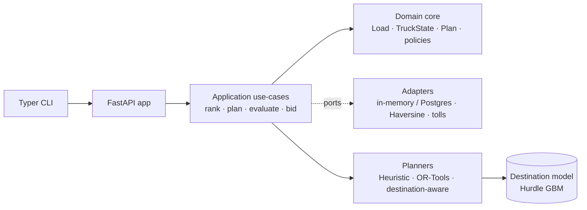
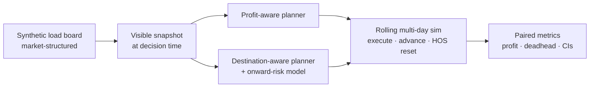

# FreightBid Agent

An AI-powered dispatch and bidding decision engine for hotshot trucking: it
recommends profitable loads, cuts deadhead, and plans routes through heuristic
scoring, OR-Tools optimization, a learned destination-risk model, and a rolling
multi-day dispatch simulation — every recommendation explainable.


## Results at a glance

| Layer | Approach | Headline result |
| --- | --- | --- |
| [Heuristic baseline](#phase-2--or-tools-route-optimization) | rule-based scoring | $396.38 profit · 11.3 mi deadhead · 88.1% feasible |
| [OR-Tools profit-aware](#phase-2--or-tools-route-optimization) | CP-SAT, profit objective | $396.79 profit · 12.0 mi deadhead |
| [OR-Tools deadhead-control](#phase-23--objective-tuning-and-the-pareto-frontier) | tuned objective weights | $392.97 profit · **7.4 mi deadhead (−34.3%)** |
| [ML destination model](#phase-31--destination-desirability-model-first-ml-layer) | Hurdle GBM | MAE 49.3 vs 61.2 zone baseline · ≤50 mi 76% |
| [Destination-aware (one-shot)](#phase-32--destination-aware-planner-closing-the-loop) | model in the planner | −12.9% deadhead at ~free profit |
| [**Rolling replay (sequential)**](#phase-33--rolling-replanning-simulation-measuring-the-sequential-payoff) | multi-day MPC A/B | **+3.9% profit · −4.7% deadhead** (150 episodes) |
| [**Stress test (robustness)**](#phase-34--sequential-policy-stress-testing-is-the-edge-robust) | 18 shifted markets | **0 regressions** · advantage HOLDS 7/18, neutral 11/18 |

Single-truck, synthetic-market simulation: the claim is **sign-stable, explainable**
dispatch gains across markets, not a magic number — see
[What I learned](#what-i-learned) and [Limitations & next work](#limitations--next-work).

## Demo

The CLI ranks loads and proposes a single-truck plan, each with a full
cost-and-bid rationale — rendered straight from the API against `sample_data/`
(regenerate with `python -m benchmarks.render_demo --update-artifacts`).

`freightbid rank sample_data/truck.json` — top loads with target bid + explanation:


`freightbid plan sample_data/truck.json` — the proposed plan with per-stop economics:


## Architecture (Hexagonal / Ports & Adapters)

**System** — a thin CLI/API over an application core that depends only on ports;
adapters and planners plug in behind them.



**Decision flow** — how a load board becomes a measured dispatch decision.



Detailed module layout:

```
domain/          Pure business types (Load, TruckState, Plan, Bid, ScoreResult,
                 LoadEvaluation), policies (constraints, feasibility, weights),
                 and the ScoringStrategy interface (Strategy Pattern).
ports/           Outbound interfaces: LoadRepositoryPort, TruckRepositoryPort,
                 DistanceProviderPort, TollEstimatorPort, ClockPort.
adapters/
  inbound/api/   FastAPI app + Pydantic schemas + composition root.
  inbound/cli/   Typer CLI that calls the API (rich tables).
  outbound/memory/    In-memory repositories  (TEST adapter for the port).
  outbound/postgres/  SQLAlchemy + Postgres repositories (REAL adapter).
  outbound/distance/  Haversine distance provider.
  outbound/tolls/     Flat-rate per-state toll estimator.
application/     Use cases: EvaluateLoadsService, RecommendLoadsService,
                 PlanBuilderService, BidRecommenderService, ConfigLoader,
                 ORToolsDistancePlanner, ORToolsProfitAwarePlanner.
config/          Editable YAML for cost model, weights, constraints.
```

> "One port, two adapters": every outbound port has at least an **in-memory test
> adapter** and a **real adapter** (Postgres, Haversine, FlatRate). The
> `ScoringStrategy` is the swappable Strategy interface (heuristic today;
> ML/LP-based variants later).

## Reproduce

One command regenerates the demo and a reduced rolling A/B **non-destructively**
— it writes only to the gitignored `benchmarks/reproduced/` (so `git status`
stays clean) and prints a run-metadata header plus the results table above:

```bash
python -m benchmarks.reproduce                     # fast smoke (~1-3 min), clean checkout OK
python -m benchmarks.reproduce --update-artifacts  # refresh the committed demo SVGs
python -m benchmarks.reproduce --full              # canonical long benchmark (~70 min)
```

On a fresh clone the gitignored model artifact is absent, so the fast path
quick-trains a small seeded destination model into `benchmarks/reproduced/`
(seconds) just to drive the reduced chart. `--full` regenerates the committed
canonical artifacts (150-episode replay + 18×30 stress sweep).

## Cost Model
Fuel, tolls, time (driver + opportunity cost), and deadhead are tracked
**separately** on `LoadEvaluation` and rolled up into `Plan` totals.

## API
- `POST /loads` — ingest a batch of loads
- `GET  /loads` — list ingested loads
- `DELETE /loads` — clear ingested loads
- `POST /rank` — top-N ranked loads for a truck (with recommended bid range + rationale)
- `POST /plan` — propose a single-truck plan over the planning horizon (default 48h)
- `GET  /health` — health probe

## Quick start (Docker Compose)

```bash
docker compose up --build
# in another shell:
curl -s http://localhost:8000/health
curl -s -X POST http://localhost:8000/loads -H 'content-type: application/json' \
  -d @sample_data/loads.json
curl -s -X POST http://localhost:8000/rank -H 'content-type: application/json' \
  -d @sample_data/rank_request.json | jq
curl -s -X POST http://localhost:8000/plan -H 'content-type: application/json' \
  -d @sample_data/rank_request.json | jq
```

## Quick start (local)

```bash
pip install -r requirements.txt
uvicorn adapters.inbound.api.app:app --reload
# in another shell:
python -m adapters.inbound.cli.main ingest sample_data/loads.json
python -m adapters.inbound.cli.main rank sample_data/truck.json --top-n 10
python -m adapters.inbound.cli.main plan sample_data/truck.json
```

## API response shapes (reference)

The same `sample_data` run as the [demo above](#demo), shown as raw JSON to
document the `/rank` and `/plan` response contracts (truck `101`, 4 loads):

**`GET /health`**
```json
{"status": "ok"}
```

**`POST /loads`** (body: `sample_data/loads.json`)
```json
{"accepted": 4}
```

**`POST /rank`** (body: `sample_data/rank_request.json`) — top ranked loads:
```json
{
  "truck_id": 101,
  "ranked": [
    {
      "load_id": 1,
      "score": 612.48,
      "expected_profit": 466.90,
      "expected_revenue": 850.00,
      "rate_per_mile": 3.54,
      "deadhead_miles": 0.0,
      "driver_hours": 6.3,
      "pickup_eta": "2026-05-27T18:00:00Z",
      "delivery_eta": "2026-05-28T00:18:00Z",
      "rationale": "profit=$466.90 x 1.0 + rpm=$3.54 x 50.0 - deadhead=0mi x 0.5 - hours=6.3h x 5.0 => score=612.48",
      "bid": {
        "min_bid": 402.26,
        "target_bid": 459.72,
        "max_bid": 517.19,
        "breakeven": 383.10,
        "rationale": "Cost=$383.10, target margin=20%, target=$459.72 ($1.92/mi). Range [$402.26, $517.19] clamped to [$100, $25000] and [$1.00, $6.00]/mi."
      }
    },
    {
      "load_id": 3,
      "score": 513.13,
      "expected_profit": 370.20,
      "expected_revenue": 720.00,
      "rate_per_mile": 3.43,
      "deadhead_miles": 0.0,
      "driver_hours": 5.7,
      "pickup_eta": "2026-05-27T20:00:00Z",
      "delivery_eta": "2026-05-28T01:42:00Z",
      "bid": {
        "min_bid": 367.29,
        "target_bid": 419.76,
        "max_bid": 472.23,
        "breakeven": 349.80
      }
    }
  ]
}
```

**`POST /plan`** (body: `sample_data/rank_request.json`) — proposed 48h plan:
```json
{
  "plan_id": 1,
  "truck_id": 101,
  "horizon_hours": 48.0,
  "stops": [
    {
      "load_id": 1,
      "pickup_eta": "2026-05-27T18:00:00Z",
      "delivery_eta": "2026-05-28T00:18:00Z",
      "deadhead_miles": 0.0,
      "load_miles": 240.0,
      "revenue": 850.00,
      "cost": 383.10,
      "profit": 466.90
    }
  ],
  "expected_revenue": 850.00,
  "expected_cost": 383.10,
  "expected_profit": 466.90,
  "expected_deadhead_miles": 0.0,
  "expected_load_miles": 240.0,
  "expected_deadhead_cost": 175.20,
  "expected_load_cost": 0.0,
  "expected_toll_cost": 0.0,
  "expected_time_cost": 207.90,
  "feasible": true,
  "score": 612.48,
  "rationale": "Sequenced 1 load(s) [1] over 48h horizon. Revenue=$850.00, Cost=$383.10, Profit=$466.90, Deadhead=0mi."
}
```

## Phase 2 — OR-Tools Route Optimization

Phase 2 reframes planning as a **prize-collecting pickup-and-delivery problem**
solved with Google OR-Tools CP routing, benchmarked against the Phase 1
heuristic over 1,000 generated scenarios. Two solver variants isolate the
effect of the objective function:

| Planner | Objective | Avg profit | Avg deadhead | Feasible rate |
|---|---|---|---|---|
| Heuristic (`PlanBuilderService`) | greedy score ranking | $396.38 | 11.3 mi | 88.1% |
| `ORToolsDistancePlanner` (v1) | minimize total miles | $240.14 (**−39.4%**) | **8.9 mi (−20.9%)** | 82.4% |
| `ORToolsProfitAwarePlanner` (v2) | maximize expected profit | **$396.79 (+0.1%)** | 12.0 mi (+6.6%) | **88.1%** |


**The ablation story.** The distance objective is a classic mis-specified
proxy: it slashes deadhead by 21% but destroys 39% of profit, because the
cheapest route to drive is rarely the most valuable one to run. The
profit-aware variant fixes the objective rather than the solver — same
constraints, same search budget — and recovers full heuristic-level profit
while retaining the solver's ability to chain multi-load routes.

**Objective formulation (profit-aware).** The solver minimizes the negative of
expected plan profit, in integer cents, derived from the YAML cost model — no
hand-tuned magic weights:

- *Repositioning arcs* cost `miles × 139¢` (fuel + maintenance + driver &
  opportunity time at average speed, from `config/cost_model.yaml`).
- *Loaded arcs* cost 0 — their economics live in the skip penalty.
- *Skipping a load* costs its position-independent static profit
  (revenue − operating cost − time cost), floored at the configured
  `min_expected_profit`: profitable loads are expensive to skip, marginal
  ones are free to drop.

Minimizing (deadhead cost + skipped profit) is equivalent to maximizing
(selected profit − deadhead cost) = expected plan profit.

Every solver plan is **replayed through the same `EvaluateLoadsService` +
feasibility pipeline as the heuristic**, so reported financials come from one
source of truth, and the solver cannot game its own reward. Both planners
share the constraint encoding (pickup-and-delivery pairing, time windows,
HOS-style driver-hours dimension, planning horizon) in
`application/ortools_distance_planner.py`; the profit-aware subclass overrides
only the objective hooks, first-solution strategy, and full-truckload
sequencing. Reproduce with:

```bash
python -m benchmarks.compare_planners --time-limit 0.2 --out benchmarks/compare_results.json
python -m benchmarks.chart_comparison --results benchmarks/compare_results.json
```

## Phase 2.3 — Objective Tuning and the Pareto Frontier

"Maximize profit" is only one dispatch policy. An operator who hates empty
miles (wear, risk, schedule fragility) may happily trade a percent of profit
for far less deadhead. Phase 2.3 turns the profit-aware objective into a
**configurable policy** and maps the tradeoff empirically: a tuning harness
(`benchmarks/tune_objective.py`) sweeps 24 objective configurations over the
same 1,000 scenarios and computes the profit-vs-deadhead **Pareto frontier**
(feasible rate ≥ 85% required; non-dominated configs only).


Only two knobs exist, both multipliers over the derived cost model — and that
is a finding, not a simplification:

- **`deadhead_cost_multiplier`** — how much above true cost to price an empty
  mile (1.0 = the real cost model).
- **`skip_profit_floor_dollars`** — solver pickiness: the static profit a load
  must clear before skipping it costs anything. Swept only **at or above**
  the business `min_expected_profit` ($50) — an objective floor below the
  replay's acceptance rule would reward the solver for proposing loads the
  feasibility pipeline then rejects.

The objective is `Σ(deadhead miles × D) + Σ(skipped margin × P)`, so scaling
`D` and `P` jointly cannot change which plan wins — only the **D/P ratio**
matters. The harness proves it (`--invariance-check`): tripling both rates
reproduces every plan bit-for-bit; tripling only `D` changes them
(−67% deadhead, −3% profit on the check slice). A naive "skip penalty
multiplier" sweep axis would have silently doubled the grid for zero
information.

**Named dispatch profiles** (`config/objective_profiles.yaml`), placed on the
measured frontier (1,000 scenarios):

| Profile | D × floor | Avg profit | Avg deadhead | Feasible |
|---|---|---|---|---|
| `max_profit` | 1.0 × $50 | **$396.79 (+0.1%)** | 12.0 mi (+6.6%) | 88.1% |
| `balanced` | 1.25 × $50 | $395.90 (−0.1%) | 10.0 mi (−11.7%) | 86.9% |
| **`deadhead_control`** ⭐ | 1.6 × $75 | $392.97 (−0.9%) | **7.4 mi (−34.3%)** | 85.4% |
| `aggressive_deadhead_control` | 2.5 × $100 | $384.91 (−2.9%) | 3.9 mi (−65.4%) | 81.9% ✗ |

*(deltas vs the heuristic baseline; ✗ = fails the ≥ 85% feasibility filter)*

**Findings.**

- **The Phase 2.2 derivation sits exactly at the frontier's max-profit end.**
  Under-pricing deadhead (0.75×) is *dominated* — more deadhead **and** less
  profit — empirical validation that the cost-model-derived 139 ¢/mi was the
  right calibration, not a lucky guess.
- **The recommended knee: `deadhead_control` cuts deadhead 34% for 0.9%
  profit** (largest deadhead reduction costing < 2% of best-config profit).
- **Deadhead aversion has a feasibility cliff.** Past ~1.6× the planner
  increasingly refuses to plan at all (feasible rate slides from 88% toward
  80%) — the floor knob mostly trades feasibility, the multiplier knob trades
  deadhead, and the filter keeps the frontier honest.
- **Runtime is not a tradeoff axis here.** The knee config produces
  bit-identical plans at 0.1 s and 1.0 s per solve (`--time-study`): the
  solver converges in under 100 ms at this instance size (≤ ~20 loads), so
  "fast vs good" is a non-decision until instances grow.

Reproduce with:

```bash
python -m benchmarks.tune_objective --time-limit 0.2 --out benchmarks/tuning_results.json
python -m benchmarks.tune_objective --invariance-check --limit 200
python -m benchmarks.tune_objective --time-study --out benchmarks/tuning_results.json
python -m benchmarks.chart_pareto --results benchmarks/tuning_results.json
```

## Phase 3.1 — Destination Desirability Model (first ML layer)

Phases 2.x optimize *today's* board. But a load that pays well today can still be
a trap if it **delivers into a dead market** — somewhere the next load is far
away or doesn't exist, forcing a long deadhead. Phase 3.1 learns that risk.

The model predicts **`expected_next_deadhead_miles`**: given a candidate
delivery (destination, arrival time, equipment), how far will the truck likely
have to deadhead to its *next* viable load? This becomes a learned
"future-opportunity" signal the planner can price in Phase 3.2
(`future_deadhead_penalty = predict_next_deadhead(...) × deadhead_cost_per_mile`).
**No planner code changes in 3.1** — the `DestinationDesirabilityService` facade
defines the contract; wiring comes later.

**Label (retrospective truth).** After a delivery, search a window
(`8h`) for the nearest viable next load — same equipment, picks up after
arrival, clears a rate bar (`≥ 1.75 $/mi`; "call for rate" loads don't count).
The label is the haversine miles to that load's origin, **censored at 300 mi**
when nothing qualifies (a genuine stranding signal, ~8% of rows).

**Leakage discipline (the hard part).** Two failure modes are designed out:
- *Decision-time features only.* Market-density features (how many loads, and
  how many equipment-matched loads, are posted within 50/100/150 mi of the
  destination *right now*) are read from the same board on which the load
  appears — never from the future board the label looks at. One feature builder
  serves both training and inference, so there's no train/serve skew.
- *Embargo + observability split.* The split is time-based (last 20% is test).
  Labels are computed against the full history (no per-pool truncation), then
  train rows whose label window reaches into the test period are **embargoed**,
  and rows whose window runs off the end of the data are dropped as
  **unobservable**. (An earlier per-pool labeling scheme manufactured fake
  "stranded" labels at each pool's edge and silently wrecked the model — there's
  a regression test for it now.)

**Model — a hurdle (two-part) regressor.** The label is right-censored and
heavy-tailed (a spike at 300 mi over a bulk of short deadheads), so a single
regressor either ignores the spike (good MAE, ~0 R²) or is dragged toward the
mean (good R², poor MAE). Instead:
- a `HistGradientBoostingClassifier` estimates `p = P(no viable next load)`;
- a `HistGradientBoostingRegressor` (absolute-error → conditional median of the
  *non-censored* bulk) estimates the deadhead when a load exists;
- they recombine into a proper expectation: `E[miles] = p·300 + (1−p)·bulk`.

Both halves use native categorical handling (`destination_zone`,
`destination_state`, `equipment_type`, `mode`) — no one-hot.

**Results** (held-out last-20%-by-time test set, 3,594 rows, 8.3% censored):

| Model | MAE | RMSE | MedAE | R² | ≤25 mi | ≤50 mi | top-3 |
|---|---|---|---|---|---|---|---|
| Global mean | 69.8 | 96.8 | 44.5 | −0.00 | 5% | 73% | 37% |
| Zone × daypart | 61.2 | 89.2 | 32.1 | 0.15 | 39% | 66% | 45% |
| **Hurdle GBM** | **49.3** | **88.7** | **13.2** | **0.16** | **64%** | **76%** | **50%** |

The model beats both baselines on **every** metric. Because the target is
censored, MAE / median / bucket-accuracy / **top-3 ranking** (its real job —
ranking destinations) are the headline metrics; R² is reported but secondary.
MedAE of 13 mi vs the baseline's 32 mi, and a 64% ≤25 mi hit rate, mean the
model usually nails the easy "you'll find a reload nearby" calls and reserves
big predictions for genuinely weak destinations.

**Why synthetic data?** Real historical board data isn't available yet, so a
seeded generator manufactures *learnable* structure: strong hubs (Dallas,
Houston, LA…) flood the board while weak markets (Boise, Albuquerque) barely
appear, and each metro has its own **hot-shot equipment mix** — so an `F`
(flatbed) load delivering into a Hot-Shot-heavy market correctly faces a high
expected deadhead (an interaction a zone-only baseline can't see, but the model
can). The schema mirrors the **real Truckstop board** (see Phase 3.0.5 below),
so a future API adapter drops in unchanged.

Reproduce (artifacts are seeded; the `.joblib` and JSONL history are
gitignored, the metadata JSON is committed):

```bash
python -m ml.training.train_destination_model --config config/ml_config.yaml
python -m ml.training.evaluate_destination_model --config config/ml_config.yaml
```

> **Phase 3.0.5 / 3.1.1 — Truckstop feature discovery (grounded).** Real board
> screenshots were captured and folded into the schema:
> `docs/truckstop_feature_discovery.md` holds the observed-field inventory. The
> board's columns confirmed the existing design (load age, "call-for-rate"
> nullable rate, derived rate-per-mile) and added real fields — hot-shot
> equipment codes (`HS`/`F`/`FSD`/`FSDV`), `weight`/`length` (+ usually-blank
> `width`/`height`), `mode` (TL/PTL/LTL), and a `Load Views` competition bucket
> (now the `open_match_within_*` "uncontested onward supply" feature). Crucially,
> the board shows deadhead only to a *user-specified* point (`O-DH` to pickup,
> `D-DH` to a typed destination) — never the open-ended next-load deadhead this
> model predicts, so the ML layer is **additive**. Broker-quality signals
> (`Days-to-Pay`, credit/bond) are observable but describe *load winnability*,
> not onward deadhead, so they're deferred to a future Phase 4 quality model.

## Phase 3.2 — Destination-Aware Planner (closing the loop)

Phase 3.1 *predicted* onward deadhead but changed no decisions. Phase 3.2 wires
that prediction into the optimizer so it actually **influences dispatch**.

The profit-aware planner prices the deadhead needed to *reach* each load, but is
blind to the deadhead a load's **destination** will impose on the *next* load.
`ORToolsDestinationAwarePlanner` subclasses it and changes a **single objective
hook** (`_drop_penalty`): each load's skip penalty becomes its static profit
*net of its destination's expected onward-deadhead cost*, above the floor:

```
skip_penalty = max(0, static_profit − dest_cost − floor) × profit_multiplier
dest_cost    = predict_next_deadhead(...) × deadhead_$_per_mile × weight
```

Folding `dest_cost` in *before* the floor keeps the solver's serve-vs-skip
break-even exact. A load delivering into a strong market keeps its full value; a
load into a weak market loses skip-incentive, so the solver declines
otherwise-profitable freight that would strand the truck. The penalty is
**position-independent** (it depends only on the destination, arrival window and
the visible board), so it stays a per-load disjunction penalty — no
path-dependent arc cost. With `destination_service=None` the planner is
byte-for-byte the profit-aware planner: **the ML signal is a feature flag, not a
fork** (and `destination_weight` scales it).

**The domain ↔ ML boundary (kept honest).** The planner speaks the domain's
trailer vocabulary (`Dry Van`/`Reefer`/`Flatbed`); the model trained on hot-shot
board codes. Two small, deliberately coarse adapters bridge them: an equipment
map (`Flatbed→F`, `Dry Van→FSDV`, everything else→`HS`) and a `_BoardLoad`
wrapper that re-shapes a domain `Load` into the feature builder's board contract
— the same contract a real Truckstop feed would satisfy. The decision-time board
is the prefiltered candidate set (each candidate excluded from its own board).

**A/B result** (1000-scenario suite, OR-Tools 0.2 s/solve, `weight=1.0`):

| Planner | Avg profit | Avg deadhead | Avg loads | Feasible | Median solve |
| --- | --- | --- | --- | --- | --- |
| Heuristic (scoring) | $396.38 | 11.3 mi | 0.91 | 88.1% | 0.2 ms |
| OR-Tools Distance | $240.14 | 8.9 mi | 0.88 | 82.4% | 202 ms |
| OR-Tools Profit-Aware | **$396.79** | 12.0 mi | 0.91 | 88.1% | 202 ms |
| OR-Tools Destination-Aware | $393.23 | **10.5 mi** | 0.89 | 86.1% | 275 ms |

Destination-aware vs. its profit-aware parent: **−0.9% profit, −12.9% deadhead,
−2.4% loads.** (The ~80 ms extra solve time is the per-candidate ML inference.)

**Reading this honestly.** This is a *one-shot* benchmark: each scenario plans
once from a fixed truck position, so the planner can only ever *decline* a load —
it never gets to collect the better next load its choice sets up. Even so, the
trade is favorable: it gives up just **0.9% of immediate profit to cut deadhead
12.9%**, declining loads bound for weak markets that the profit-aware planner
takes blindly. That's the safety behavior we wanted, and it's nearly free here.
The *full* payoff (actually collecting the closer next load) only materializes
under **sequential replanning** — a rolling multi-day simulation is the natural
next step (Phase 3.3) to measure it end-to-end. Charging the full predicted cost
(`weight=1.0`) in a one-shot plan is intentionally the most conservative setting;
`destination_weight` tunes the profit-vs-repositioning trade.

Reproduce (destination-aware column appears only when the gitignored model
artifact exists locally):

```bash
python -m benchmarks.compare_planners --time-limit 0.2 --out benchmarks/compare_results.json
```

## Phase 3.3 — Rolling Replanning Simulation (measuring the sequential payoff)

The Phase 3.2 A/B was *one-shot*: the planner chooses once, so it can only ever
**decline** a stranding load — it never gets to collect the better next load its
choice sets up. That's why it cost 0.9% profit to save deadhead. Phase 3.3 builds
the missing piece: a **rolling-horizon (MPC-style) simulation** that lets a truck
replan over a multi-day week, so the destination signal's *downstream* payoff
shows up end-to-end.

**How it works.** Each **episode** is one synthetic world — a time-stamped stream
of board snapshots from the **Phase 3.1 generator** (the same market structure the
model trained on, so it is tested in-distribution, *not* on the uniform benchmark
generator). The loop is deliberately thin (`simulation/`):

```
observe visible board → planner picks → execute only the first load → advance
truck (position, clock, HOS) → replan at the next snapshot → … until the horizon
```

* **`SnapshotBoard`** answers "what can the truck take right now?": the latest
  snapshot at or before the clock, filtered by equipment, pickup-window expiry,
  radius and consumed loads, then adapted from ML records to domain `Load`s.
* **`TruckSimulator`** owns *no cost math*. The planners already produce a
  position-aware financial replay on `plan.stops[0]` via `EvaluateLoadsService`,
  so the simulator just **lifts those realized numbers** and advances the truck to
  the delivered destination — rolling metrics therefore reconcile exactly with the
  one-shot engine (there is a regression test for this). A simple daily
  Hours-of-Service reset keeps a single truck from running dry after day one.
* **Same world, same truck, every planner.** Only the dispatch policy differs.

**Policy divergence (shadow comparison).** To explain effect size, while the
profit-aware truck runs, the destination-aware planner rides along as a *shadow*:
at each decision it is asked what it *would* pick from the **identical** board and
truck state, **without executing**. The agreement flag yields a
`decision_overlap_rate`. Forced idles (both planners decline an HOS-depleted
board) are excluded — only genuine choice points count.

**A/B result** (150 episodes × 7-day horizon, OR-Tools 0.2 s/decision,
`weight=1.0`; 95% bootstrap CIs):

| Planner | Cumulative profit | Cumulative deadhead | Idle hrs | Loads | Profit/day | Deadhead/load |
| --- | --- | --- | --- | --- | --- | --- |
| OR-Tools Profit-Aware | $1,682.7 `[1562, 1806]` | 123.7 mi `[110, 138]` | 67.8 | 5.6 | $240.4 | 19.6 mi |
| OR-Tools Destination-Aware | **$1,749.0** `[1624, 1878]` | **118.0 mi** `[106, 130]` | 67.7 | 5.6 | **$249.9** | **18.9 mi** |

Destination-aware vs. its profit-aware parent: **+3.9% profit and −4.7% deadhead**
(−3.8% deadhead per load), idle hours and load count flat.

**The headline: rolling flips the one-shot trade-off.** What cost 0.9% profit in
the single-shot benchmark now *earns* +3.9% — because the truck actually collects
the closer next load that pricing onward-deadhead set up. Same model, same weight;
the only change is letting decisions compound. That is exactly the hypothesis this
simulation was built to test.

**Reading this honestly.** The two policies agree **92.4%** of the time (divergence
**7.6%** over 838 genuine decisions), so the effect is carried by a minority of
episodes, and a paired per-episode view (both planners ran the same world) is the
fair lens:

* **Profit:** mean Δ **+$66.3/episode** — better in **34** episodes, tied in **98**,
  worse in **18**.
* **Deadhead:** mean Δ **−5.8 mi/episode** — better in **30**, tied in **98**,
  worse in **22**.

So on the ~1/3 of worlds where the policies diverge, destination-awareness wins
clearly more often than it loses, and never hurts on the other two-thirds. Two
honest caveats: (1) a single-truck, simple-HOS model completes only ~5.6 loads/
week, which bounds how much decisions can compound; (2) the model's *predicted*
onward-deadhead barely tracks the *realized* onward miles in this loop
(correlation ≈ 0.02, MAE ≈ 17.8 mi) — the realized proxy is shaped by HOS timing
and the next snapshot, not destination strength alone — yet the **aggregate
dispatch nudge is still net-positive**. Tightening that signal (and multi-truck /
finer HOS) is the natural Phase 4+ direction. See
`benchmarks/rolling_replay_comparison.png` for the full distribution view.

Reproduce (destination-aware trajectory appears only when the gitignored model
artifact exists locally):

```bash
python -m benchmarks.run_rolling_replay --episodes 150 --out benchmarks/rolling_replay_summary.json
python -m benchmarks.chart_rolling_replay
```

## Phase 3.4 — Sequential Policy Stress Testing (is the edge robust?)

Phase 3.3 showed the destination-aware policy wins **in one synthetic world**. The
question a skeptical reviewer asks next — and the one that separates a portfolio
*toy* from a portfolio *result* — is whether that win is real or an artifact of the
baseline market. Phase 3.4 answers it by replaying the same rolling A/B under **18
shifted market conditions** and asking: does the advantage survive?

**Design.** One *condition* is a perturbation of the baseline world / economics /
HOS. The sweep is **one-factor-at-a-time** (OFAT) — move a single axis, hold the
rest at baseline — plus three **combined stress corners**:

* **market density** — 25 / 120 loads per snapshot (baseline 60)
* **unposted-rate fraction** — 0.35 / 0.50 (baseline 0.15)
* **load-view competition** — 25% / 50% of visible loads skimmed first by rival
  demand, biased toward high-view (contested) loads (`simulation/snapshot_board.py`)
* **fuel / deadhead cost** — $0.95/mi fuel, or 1.5× empty-mile burn — rebuilds the
  *whole* cost stack: the realized evaluator **and** the planners' objective
  weights, so they optimise the same economics they're scored on
* **HOS strictness** — 8 h / 14 h daily drive cap (baseline 11 h)
* **equipment mix** — pin every truck to hot-shot, or to flatbed
* **horizon length** — 3 / 14 days (baseline 7)
* **corners** — thin market (scarce + half-unpriced + half-contested), expensive
  miles under a tight HOS cap, and a worst case combining all of it over 14 days

Two choices keep it honest. (1) **The model artifact never changes** — it is the
same one trained on the baseline distribution, so every condition is an
**inference-time distribution shift, not a retrain** (testing whether a fixed
learned signal generalises). (2) Every condition shares the baseline's seed stream
(**Common Random Numbers**), so a condition's only difference from baseline is the
perturbed parameter — a variance-reduced comparison. Each condition earns a paired
verdict: **HOLDS** (paired profit CI ≥ 0 *and* deadhead no worse), **REGRESSION**
(paired profit CI entirely < 0), otherwise **NEUTRAL**.

**Result** (18 conditions × 30 episodes × 2 planners, OR-Tools 0.2 s/decision,
68.7 min; Δ = destination-aware − profit-aware, 95% paired bootstrap CIs):

| Condition | Shift from baseline | Verdict | Profit Δ% `[95% CI]` | Deadhead Δ% |
| --- | --- | --- | --- | --- |
| `baseline` | the Phase 3.3 world | **HOLDS** | **+3.9** `[+0.3, +7.8]` | −16.4 |
| `density_low` | 25 loads/snapshot | neutral | +0.5 `[−1.5, +2.9]` | +2.3 |
| `density_high` | 120 loads/snapshot | neutral | +1.3 `[−0.8, +4.1]` | −4.8 |
| `unposted_035` | 35% "call for rate" | **HOLDS** | **+8.1** `[+3.5, +13.3]` | −5.5 |
| `unposted_050` | 50% "call for rate" | **HOLDS** | **+5.4** `[+1.5, +10.5]` | −2.6 |
| `competition_025` | 25% of board skimmed | neutral | +5.1 `[−0.0, +11.3]` | −11.2 |
| `competition_050` | 50% of board skimmed | neutral | +2.3 `[−0.3, +5.4]` | −6.8 |
| `fuel_095` | fuel $0.55→$0.95/mi | **HOLDS** | **+9.6** `[+2.7, +16.9]` | −1.8 |
| `deadhead_15` | 1.5× empty-mile burn | neutral | +3.8 `[−0.2, +9.8]` | −10.8 |
| `hos_strict_8` | 8 h daily drive cap | neutral | +2.9 `[−1.6, +7.9]` | −4.4 |
| `hos_relaxed_14` | 14 h daily drive cap | neutral | +1.7 `[−2.8, +6.7]` | −9.2 |
| `equip_hs` | all trucks hot-shot | **HOLDS** | **+3.7** `[+1.2, +6.8]` | −14.0 |
| `equip_f` | all trucks flatbed | neutral | +3.4 `[−0.4, +8.4]` | −9.0 |
| `horizon_3` | 3-day horizon | **HOLDS** | **+6.9** `[+0.9, +14.0]` | −33.1 |
| `horizon_14` | 14-day horizon | **HOLDS** | **+6.7** `[+2.4, +11.7]` | −6.7 |
| `corner_thin_market` | scarce + unpriced + contested | neutral | +3.0 `[−1.8, +9.5]` | −4.3 |
| `corner_expensive_miles` | costly miles + tight HOS | neutral | +4.2 `[−5.1, +12.4]` | −15.1 |
| `corner_worst_case` | everything hostile, 14-day | neutral | −2.8 `[−14.2, +6.6]` | −17.8 |

**The headline: zero regressions across all 18 conditions.** Profit improves in
**17/18** (the lone dip is the deliberately brutal worst-case corner at −2.8%, whose
CI `[−14.2, +6.6]` straddles zero — not a significant loss), and deadhead falls in
**17/18**. The advantage is **significant (HOLDS) in 7** conditions and
**directionally positive but not individually significant (neutral) in 11**.

**Reading this honestly.** At 30 episodes/condition the per-condition CIs are wide,
so most shifts land "neutral": the point estimate favours destination-awareness but
the interval still includes zero. What's compelling is not any single cell — it's
the **consistency of sign**. The edge never reverses, and it is strongest exactly
where the economics say it should be: expensive empty miles (`fuel_095` **+9.6%**),
a sparse *priced* board (`unposted_035` **+8.1%**), and longer horizons that let
decisions compound (`horizon_14` **+6.7%**). Even the worst-case corner — scarce,
contested, expensive, HOS-throttled, over two weeks — still **cuts deadhead 17.8%**
while giving back only a statistically-insignificant slice of profit. The one place
deadhead ticks *up* (`density_low`, +2.3%) is also not significant.

The caveat from Phase 3.3 carries over and bounds the magnitudes: a single truck
with a simple daily-HOS model completes only ~5–6 loads/week, so there is limited
room for a per-load signal to compound. The robustness claim here is deliberately
modest and precise — **sign stability of the destination-aware advantage across a
wide spread of markets**, not a large effect in any one of them. That a fixed
signal trained on one distribution stays net-positive under density, competition,
cost, HOS, equipment, and horizon shifts is the evidence that the Phase 3.1→3.3
loop learned something real rather than overfitting the baseline world. See
`benchmarks/stress_test_comparison.png` for the forest plot.

Reproduce (destination-aware trajectory appears only when the gitignored model
artifact exists locally; otherwise every condition is reported `DEST_SKIPPED`):

```bash
python -m benchmarks.run_stress_test --episodes 30 --out benchmarks/stress_test_summary.json
python -m benchmarks.chart_stress_test
```

## Tests

```bash
pytest -q
```

## Configuration
All weights, costs, and constraints are YAML-driven (`config/`). Override the
config directory with `FREIGHTBID_CONFIG_DIR`.

## Benchmark metrics tracked
- Total expected profit per plan
- Profit per mile, profit per driver-hour
- Deadhead miles & deadhead-to-revenue ratio
- Feasibility rate (loads scored / loads ingested)
- Plan utilization (driver hours used / horizon hours)

See `notebooks/experiments.ipynb` for ablation scaffolding.

## What I learned
- **Aggregate nudging beats per-load prediction.** Inside the rolling loop the
  destination model's per-decision predicted-vs-realized onward-deadhead
  correlation is weak (~0.02), yet steering the *distribution* of accepted loads
  toward stronger markets still produced **+3.9% profit / −4.7% deadhead**. The
  value is shifting many decisions slightly, not nailing any single one.
- **Sequence changes the verdict.** The same signal looks like a small *penalty*
  in a one-shot benchmark (−0.9% profit) but flips to a *gain* once decisions
  compound over a multi-day horizon — a dispatch policy has to be evaluated the
  way it is actually used.
- **Discipline is what makes the number trustworthy.** Decision-time-only
  features, a split embargo, Common Random Numbers across A/B conditions, and a
  one-shot↔rolling reconciliation test are what separate a real 3.9% from a leak.
- **Honest caveats build credibility.** Documenting the weak in-loop correlation,
  the censored labels, and the single-truck bound makes the result more
  believable, not less.

## Limitations & next work
**Limitations**
- **Single truck, simple HOS.** One unit with a basic daily drive-hour reset caps
  how much the destination edge can compound; a fleet would amplify (or stress) it.
- **Synthetic market.** The world is generated from market profiles informed by
  real Truckstop board screenshots, but it is not real booking data — magnitudes
  are indicative, not forecasts.
- **Weak in-loop signal.** Predicted onward-deadhead correlates only weakly with
  realized onward-deadhead inside the loop; the gain is aggregate, not per-decision.
- **Censored labels.** Onward-deadhead is capped (300 mi) and ~8% censored, so the
  regressor learns a truncated target.

**Next work**
- **Phase 4 — broker / load quality & winnability.** Fold in the deferred
  days-to-pay / credit / bond signals and a bid-acceptance model.
- **Multi-truck dispatch.** Fleet-level assignment so the destination edge can compound.
- **Real Truckstop adapter.** Swap the synthetic board for a live feed behind the existing port.
- **Agent orchestration.** Multi-agent search and negotiation over the planners.

## Resume bullet
> **FreightBid Agent — AI dispatch & bidding decision engine (Python, FastAPI,
> OR-Tools, scikit-learn).** Built a hexagonal freight-dispatch system that ranks
> loads, optimizes routes with OR-Tools CP-SAT, and folds a learned
> destination-risk model (Hurdle GBM, MAE 49.3 vs 61.2 baseline) into planning; a
> 150-episode rolling multi-day A/B simulation showed **+3.9% profit and −4.7%
> deadhead**, validated as **sign-stable across 18 shifted markets (0
> regressions)**, with reproducible benchmarks and 100 passing tests.

**For recruiters / reviewers (the 90-second path):** read this section, the
[results table](#results-at-a-glance), and the [demo](#demo); run
`python -m benchmarks.reproduce`; then skim [What I learned](#what-i-learned). The
per-phase sections below are the full deep dive.
